# Two-Stage Miller-Compensated OTA — GPDK045 45nm

**Tool:** Cadence Virtuoso IC615 · Spectre MMSIM121 · ADE L / ADE XL · Assura DRC / LVS / RCX  
**PDK:** GPDK045 v5.0 · 45nm · VDD = 1.2V · CL = 10pF  
**OS:** CentOS 6 32-bit Linux · VMware Workstation Pro

---

> **Project narrative:** After completing schematic-level verification (75.6 dB gain, 57.5 MHz GBW, 60.9° phase margin), this OTA was carried through full physical signoff — layout, DRC, LVS, and PEX-based post-layout verification — in GPDK045 45nm. LVS debugging uncovered a systematic pattern across five separate nets: gate poly extensions that were never tied into their intended Metal1 buses, resolved with a consistent Contact-plus-Metal1 fix. A more subtle finding followed: even after LVS reported the input pins fully matched, RCX's stricter geometric extraction showed the input was still electrically isolated from the differential pair's gate — a genuine LVS-vs-RCX tolerance discrepancy that was traced and resolved. Post-layout bias verification then surfaced three further issues in sequence: a tail-node short caused by a shared source strap also carrying a substrate tap; a missing bias reference current in the extracted testbench (ideal current sources have no physical layout representation); and, after correcting a misread BSIM4 operating-point field that had been masking the true picture, a deep dive into bistable DC convergence that traced a persistent operating-point collapse to its real structural cause — the second-stage output transistor's 25 fingers were wired as a series chain rather than the intended parallel multi-finger device, severely undercutting its drive strength. This document tracks every discrepancy between simulator-reported connectivity, the actual extracted netlist, and the physical diffusion layout, rather than stopping at the first plausible-looking fix.

---

## Table of Contents

1. [Circuit Topology](#1-circuit-topology)
2. [Device Sizing](#2-device-sizing)
3. [DC Operating Point](#3-dc-operating-point)
4. [AC Simulation — Gain & Stability](#4-ac-simulation--gain--stability)
5. [Transient Simulation — Slew Rate & Settling](#5-transient-simulation--slew-rate--settling)
6. [Noise Analysis](#6-noise-analysis)
7. [CMRR Simulation](#7-cmrr-simulation)
8. [PSRR Simulation](#8-psrr-simulation)
9. [Corner Sweep — ADE XL](#9-corner-sweep--ade-xl)
10. [Monte Carlo & Offset Budget](#10-monte-carlo--offset-budget)
11. [Layout Implementation](#11-layout-implementation)
12. [LVS Signoff & Debugging](#12-lvs-signoff--debugging)
13. [PEX / Post-Layout Verification](#13-pex--post-layout-verification)
14. [Pre-Layout vs Post-Layout Results](#14-pre-layout-vs-post-layout-results)
15. [Known Limitations & Documented Waivers — Physical Design](#15-known-limitations--documented-waivers--physical-design)
16. [Results Summary](#16-results-summary)
17. [Engineering Discussion — Design Limitations](#17-engineering-discussion--design-limitations)
18. [Environment & 32-bit Workarounds](#18-environment--32-bit-workarounds)
19. [Next Steps](#19-next-steps)

---

## 1. Circuit Topology

A two-stage Miller-compensated OTA is one of the most fundamental analog building blocks in IC design — appearing inside ADCs, PLLs, LDOs, and switched-capacitor filters. Two gain stages are required because a single differential pair at 45nm gives only ~25–35 dB intrinsic gain (gm×ro), well below the 60 dB target. Cascading a second common-source stage multiplies the gain:

```
Av_total = (gm1 × Ro1) × (gm6 × Ro2)
```

Two stages introduce two poles, creating a phase-shift problem. Miller compensation places Cc from VOUT back to the first-stage output, creating dominant-pole splitting: p1 is pushed to very low frequency, p2 is pushed high, and phase margin is recovered.

```
Signal:  VIN+ → M1 → NET_A → M3/M4 mirror → NET_B → M6 gate → VOUT
Bias:    IREF → M8 (diode-connected) → BIAS → M5 gate, M7 gate
Miller:  VOUT → Cc → Rz → NET_B    (feedback compensation path only)
```

> **Critical topology note:** M6 gate connects **directly** to NET_B. Rz and Cc form a separate parallel feedback path. M6 gate is **not** in series with Rz. This is the single most common wiring error in Miller OTA design — connecting M6 gate to the node between Rz and Cc removes M6's DC bias path and collapses VOUT to near VSS.

| Equation | Defines |
|---|---|
| `GBW = gm1 / (2π·Cc)` | Unity-gain bandwidth — set by input pair and compensation cap |
| `p1 = 1 / (gm6·Cc·Ro1·Ro2)` | Dominant pole — pushed very low by Miller effect |
| `p2 = gm6 / (2π·CL)` | Non-dominant pole — pushed high by Miller effect |
| `p2 > 2.2 × GBW` | Condition for PM > 60° |
| `fz = gm6 / (2π·Cc)` | RHP zero from Cc alone — removed by Rz |
| `Rz_ideal = 1/gm6` | Nulling resistor value to push zero to infinity |

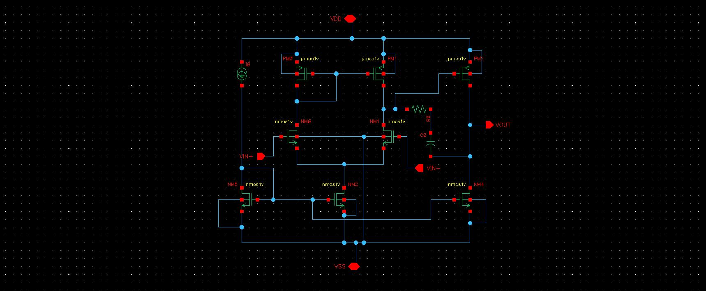
*Full OTA schematic with device labels, net names (NET_A, NET_B, TAIL, BIAS, VOUT), and Rz-Cc feedback path*

---

## 2. Device Sizing

| Device | Type | W | L | Role | Key Point |
|---|---|---|---|---|---|
| M1 | NMOS nmos1v | 4 µm | 180 nm | Diff pair (+) input | VIN+ terminal |
| M2 | NMOS nmos1v | 4 µm | 180 nm | Diff pair (−) input | VIN− terminal |
| M3 | PMOS pmos1v | 6 µm | 180 nm | Active load — diode-connected | Sets mirror reference |
| M4 | PMOS pmos1v | 6 µm | 180 nm | Active load — current mirror | First-stage output load |
| M5 | NMOS nmos1v | 4 µm | 180 nm | Tail current source | Sets Id for M1/M2 |
| M6 | PMOS pmos1v | 250 µm | 180 nm | Second-stage amp (CS) | Dominant gm6 device |
| M7 | NMOS nmos1v | 50 µm | 180 nm | Second-stage load | Current source at VOUT |
| M8 | NMOS nmos1v | 4 µm | 180 nm | Bias reference | Diode-connected, generates BIAS |
| Cc | analogLib cap | 1.35 pF | — | Miller compensation | Sets p1 and GBW |
| Rz | analogLib res | 100 Ω | — | Nulling resistor | Removes RHP zero; ideal = 1/gm6 = 83 Ω |
| IREF | analogLib idc | 100 µA | — | Bias current | Testbench only |
| CL | analogLib cap | 10 pF | — | Load capacitor | Testbench only; drives p2 requirement |

> **mimcap note:** mimcap was explored for Cc but is impractical — GPDK045 mimcap max cell is 5.6µm × 5.6µm giving ~32 fF/unit, requiring multiplier=32 for ~1 pF (barely sufficient, poor layout density of 0.755 fF/µm²). `nmoscap1v` is used in layout as the on-chip capacitor implementation.

---

## 3. DC Operating Point

**Testbench:** Unity-gain buffer configuration (VOUT → VIN+, VIN− = 0.6V DC, VDD = 1.2V).  
**Purpose:** Verify every transistor is in the correct operating region before running any AC or transient simulation. A device in triode has significantly lower output impedance and will degrade gain.


*AC and DC testbench — unity-gain buffer with iprobe inserted in feedback wire for STB analysis*

### 3.1 Device Operating Points (TT, 27°C)

| Device | Id | Vgs (V) | Vds (V) | gm (mA/V) | Region |
|---|---|---|---|---|---|
| M1 | 38.1 µA | 0.522 | 0.504 | 0.602 | ✅ Saturation |
| M2 | 37.98 µA | 0.522 | 0.529 | 0.600 | ✅ Saturation |
| M3 | 38.06 µA | −0.618 | −0.618 | 0.327 | ✅ Saturation |
| M4 | 37.98 µA | −0.618 | −0.593 | 0.327 | ✅ Saturation |
| M5 | 76.05 µA | 0.568 | 0.078 | 0.756 | ⚠️ **Triode** |
| M6 | 1.254 mA | −0.593 | −0.600 | 12.07 | ✅ Saturation |
| M7 | 1.254 mA | 0.568 | 0.600 | 15.19 | ✅ Saturation |
| M8 | 99.93 µA | 0.568 | 0.568 | 1.211 | ✅ Saturation |

### 3.2 Key Node Voltages

| Node | Voltage | Significance |
|---|---|---|
| VDD | 1.200 V | Supply rail |
| VOUT | ~0.600 V | Mid-rail ✅ correct for unity-gain with VIN−=0.6V |
| BIAS | 0.568 V | M5 and M7 gate bias from M8 diode |
| TAIL | 0.078 V | M1/M2 common source — very low due to headroom limit |
| NET_A | 0.582 V | Diode-connected PMOS load output |
| NET_B | 0.607 V | First-stage output / M6 gate input |

### 3.3 M5 in Triode — Why It Happens and Why It Was Accepted

M5 operates in triode (Vds = 78 mV < Vdsat = 116 mV). This is a fundamental 1.2V supply headroom limitation:

```
Available headroom for M5: VDD − Vgs(M1) − Vds_needed(M5) = 1.2V − 0.522V − needed = ~78 mV
Vdsat(M5) = 116 mV  →  Triode
```

Accepted because: triode M5 only degrades CMRR (low tail impedance = poor common-mode rejection). All signal-path devices remain in saturation. Measured CMRR = 76.4 dB still passes the 60 dB target. Attempts to fix M5 by widening it or increasing IREF all pushed M1/M2 into subthreshold before M5 entered saturation — an unavoidable headroom conflict at 1.2V/45nm.

---

## 4. AC Simulation — Gain & Stability

### 4.1 STB Analysis Method

Spectre STB (stability) analysis inserts an `iprobe` (ideal zero-impedance current probe) into the feedback wire. The iprobe does not disturb the DC operating point but allows Spectre to inject a test signal and measure the complex loop gain T(f) at every frequency. This is the correct method for measuring open-loop gain and phase margin of a closed-loop circuit — manually breaking the loop can create a different DC operating point at the break point, giving incorrect phase margin readings.

**ADE L output expressions used:**

| Expression | Measures |
|---|---|
| `getData("loopGain" ?result "stb")` | Complex loop gain vs. frequency (Bode plot) |
| `cross(mag(getData("loopGain")), 1, 1, "falling")` | GBW: frequency where gain crosses 0 dB falling |
| `180 + phaseMargin(getData("loopGain" ?result "stb"))` | Phase margin in degrees |

> **Why add 180 to phaseMargin():** `phaseMargin()` returns the phase at the GBW crossing frequency (e.g. −119.1°). Phase margin = distance from −180° = 180 + (−119.1) = **60.9°**.

### 4.2 AC Results (TT, 27°C)

| Parameter | Measured | Target | Status |
|---|---|---|---|
| DC open-loop gain | **75.6 dB** | > 60 dB | ✅ PASS |
| GBW (unity-gain BW) | **57.5 MHz** | > 100 MHz | ⚠️ Below target |
| Phase margin | **60.9°** | > 60° | ✅ PASS |
| Cc | 1.35 pF | — | — |
| Rz | 100 Ω | — | — |
| CL | 10 pF | — | — |

### 4.3 GBW Limitation — Why 100 MHz Was Not Achieved

The GBW target of 100 MHz is a fundamental constraint at 1.2V/45nm. Three compounding factors:

**1. gm1 headroom ceiling**  
M1/M2 at W=4µm, Id=38µA → gm1=601µA/V. Increasing W to boost gm1 lowers Vov, pushing M1/M2 toward subthreshold (Vgs=522mV, Vth≈491mV — only 31mV margin). The tail node provides insufficient Vgs headroom once width exceeds ~10µm.

**2. Miller loading from M6**  
M6 at W=250µm has large Cgd6. Miller multiplication at NET_B effectively increases the load capacitance seen by the first stage, reducing first-stage bandwidth.

**3. p2 ceiling from CL**  
`p2 = gm6/(2π·CL) = 12.07mA / (2π × 10pF) = 192 MHz`. For PM ≥ 60°, GBW must stay below `p2/2.2 = 87 MHz`. This is the hard ceiling — GBW cannot exceed this without degrading phase margin.

### 4.4 AC Tuning Iterations

| Cc | M6 W | GBW | PM | Observation |
|---|---|---|---|---|
| 1 pF | 18 µm | 37 MHz | 11° | PM critically low; also Rz/Cc in wrong order at this stage |
| 4 pF | 18 µm | 30 MHz | 60° | PM OK but GBW too low |
| 1.5 pF | 500 µm | 90 MHz | 51° | GBW up but PM down — M6 too wide causes Miller loading |
| 2 pF | 600 µm | 60 MHz | 67.6° | Near target; GBW still below 100 MHz |
| **1.35 pF** | **250 µm** | **57.5 MHz** | **60.9°** | **Final — best achievable tradeoff** |

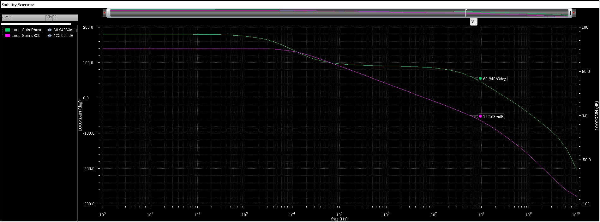
*Loop gain magnitude (dB) and phase (°) vs. frequency. DC gain 75.6 dB, GBW crossing at 57.5 MHz, phase at GBW = −119.1°, PM = 60.9°*

---

## 5. Transient Simulation — Slew Rate & Settling

### 5.1 Testbench Configuration

| Parameter | Value | Reason |
|---|---|---|
| Input source | vpulse on VIN− | Step input while VIN+ = VOUT (unity-gain buffer) |
| V1 / V2 | 0.3V / 0.9V | ±0.3V symmetric swing around 0.6V mid-rail |
| Rise/fall time | 1 ns | Much faster than OTA SR — ensures slew limiting is visible |
| Period (SR measurement) | 400 ns | Captures multiple cycles |
| Period (settling measurement) | 5 µs | Necessary — falling edge did not settle within 400 ns |
| Simulation time | 6 µs | Captures one full 5 µs period + margin |

### 5.2 Slew Rate Measurement

**Method 1 — Two-marker manual:**  
SR_rising = (0.804 − 0.340)V / (19.45 − 12.0)ns = **62.2 V/µs**

**Method 2 — `deriv()` calculator (preferred — finds true instantaneous peak):**
```
deriv(VT("/VOUT"))
```
Places marker at peak of dV/dt waveform.

### 5.3 Results

| Parameter | Measured | Target | Status |
|---|---|---|---|
| SR rising (deriv peak) | **64.5 V/µs** | > 20 V/µs | ✅ PASS |
| SR falling (deriv peak) | **55 V/µs** | > 20 V/µs | ✅ PASS |
| Settling time rising (0.1%) | **18.6 ns** | < 100 ns | ✅ PASS |
| Settling time falling (0.1%) | **223 ns** | < 100 ns | ❌ FAIL |
| Overshoot (rising) | ~3.3% | — | Consistent with PM = 60.9° |

### 5.4 Asymmetry Analysis — Why Rising ≠ Falling

**Rising edge:** M6 (PMOS, W=250µm) actively sources current into CL. Under large-signal drive, M6 can source well above its DC bias current of 1.254 mA. The loop closes quickly → 18.6 ns settling.

**Falling edge:** M6 turns off. Only M7 (NMOS, W=50µm, Id=1.254 mA) pulls VOUT down. Theoretical `SR_falling = Id_M7 / CL = 1.254mA / 10pF = 125 V/µs`. The fast initial drop (55 V/µs) confirms M7 pulls hard. But then a slow exponential tail dominates for 200+ ns.

### 5.5 Pole-Zero Doublet — Root Cause of Slow Falling Tail

The Rz-Cc network creates a LHP zero to cancel the Miller pole (p1). Perfect cancellation requires `Rz = 1/gm6 = 83 Ω` exactly. Rz=100 Ω is a standard resistor value — the mismatch leaves a residual uncancelled pole-zero pair called a **doublet**. This doublet creates a second time constant in the step response: the output settles quickly via the dominant pole, then drifts slowly via the doublet time constant.

```
τ_doublet ≈ 1/GBW = 1/57.5MHz = 17 ns per time constant
0.1% settling ≈ 7τ = 7 × 17 ns = 119 ns  (measured: 223 ns — same order)
```

This is not a design error but a known tradeoff: exact Rz=1/gm6 cancellation would improve falling settling but gm6 varies with bias and corner, so a fixed Rz can never perfectly cancel at all conditions.

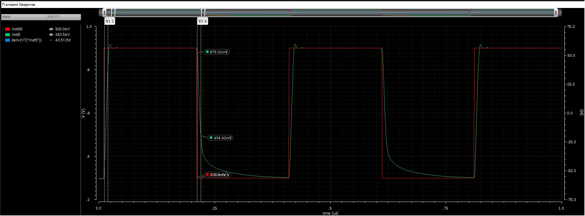
*Full transient — VOUT (green) and VIN (red). Fast rising edges, slow exponential falling tails visible.*

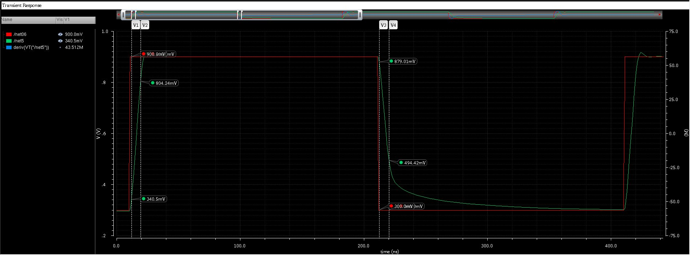
*Single period zoom — rising edge overshoot (~3.3%), fast settling on rising side, slow doublet tail on falling side.*

---

## 6. Noise Analysis

### 6.1 Input-Referred Noise Concept

Every transistor generates random current noise. Output noise is the sum of all internal contributions amplified to the output. **Input-referred noise** divides output noise by the gain at each frequency, collapsing all sources to one equivalent noise at the input. This allows direct SNR comparison: if input noise is 10 nV/√Hz and signal bandwidth is B Hz, total RMS noise = 10√B nV.

### 6.2 Three Regions of the Noise Curve

| Region | Frequency Range | Physical Source | This Design |
|---|---|---|---|
| Flicker (1/f) | 1 Hz – 1.4 MHz | Charge carriers trapped/released at gate oxide interface defects. Power ∝ 1/f. | 11.39 µV/√Hz at 1 Hz, falling at −10 dB/decade |
| Thermal floor | 1.4 MHz – ~20 MHz | Random thermal carrier collisions in MOSFET channel. `Sn = 4kT(2/3)/gm1`. Flat. | **9.5 nV/√Hz** — set by gm1 = 601 µA/V |
| Noise gain peaking | Above ~20 MHz | Artifact: as gain rolls off above GBW, input-referred = output/gain rises. Not real noise. | Rises to 91.3 nV/√Hz near 100 MHz — irrelevant |

### 6.3 Measured Results

| Parameter | Value |
|---|---|
| Input-referred noise at 1 Hz | 11.39 µV/√Hz |
| Thermal noise floor | 9.5 nV/√Hz |
| Flicker corner frequency | **1.4 MHz** |
| Integrated RMS (1 Hz – 100 MHz) | ~107 µV |

**Flicker corner calculation:**
```
fc = (noise_at_1Hz / thermal_floor)² × 1Hz
   = (11391 nV/√Hz ÷ 9.5 nV/√Hz)² × 1Hz
   = 1199² × 1Hz = 1.44 MHz ≈ 1.4 MHz
```

### 6.4 Why 45nm Has High Flicker Corner

At 45nm, gate oxide is ~1.5 nm — one or two atomic layers. This creates more interface defects per unit area and enables quantum tunnelling into a larger trap volume, both increasing the flicker noise coefficient KF:

| Node | Oxide thickness | Typical NMOS flicker corner |
|---|---|---|
| 350 nm | ~8 nm | ~100 Hz – 1 kHz |
| 180 nm | ~4 nm | ~1 kHz – 10 kHz |
| 90 nm | ~2 nm | ~100 kHz – 1 MHz |
| **45 nm (this design)** | **~1.5 nm** | **~1 MHz – 5 MHz** |
| 28 nm (HfO2 high-k) | ~1 nm | ~10 MHz – 100 MHz |

### 6.5 Application Suitability

| Application | Signal frequency | Verdict |
|---|---|---|
| ECG / EEG (medical) | 0.1 Hz – 200 Hz | ❌ Deep in flicker region — needs chopper or 180 nm process |
| Audio amplifier | 20 Hz – 20 kHz | ❌ Flicker dominated — use PMOS input pair or older process |
| Baseband (WiFi/BT) | 1 MHz – 50 MHz | ✅ Near/above flicker corner — acceptable |
| RF receiver (2.4 GHz) | 2.4 GHz | ✅ Far above flicker — thermal floor only at 9.5 nV/√Hz |

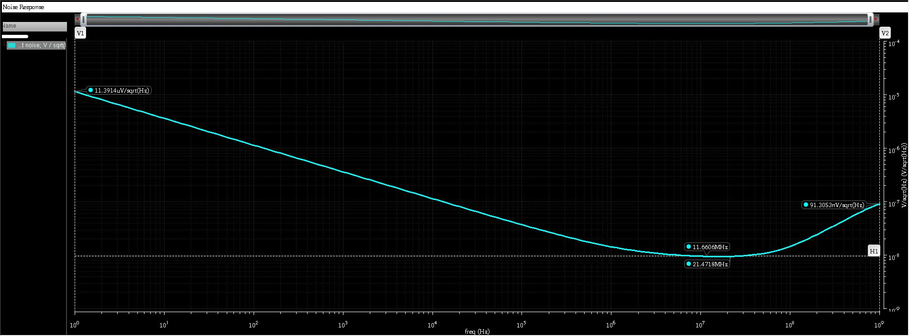
*Log-log input-referred noise: 1/f slope below 1.4 MHz, flat thermal floor at 9.5 nV/√Hz, noise gain peaking above 20 MHz.*

---

## 7. CMRR Simulation

**CMRR = Adm / Acm** — how much better the OTA amplifies a differential signal compared to a common-mode signal applied to both inputs simultaneously.

### 7.1 Testbench Setup

1. Break unity-gain feedback (disconnect VOUT from VIN+)
2. Connect a single vac source (DC=0.6V, AC=1) to **both** VIN+ and VIN− simultaneously
3. VOUT connects only to CL (open loop)
4. Run AC: 1 Hz – 10 MHz, 20 pts/decade
5. Plot VOUT in dB20 → this is Acm(f)

### 7.2 Results

| Parameter | Value | Target | Status |
|---|---|---|---|
| Acm at 1 kHz | −0.807 dB | — | Recorded |
| Adm (DC open-loop) | 75.6 dB | — | From AC simulation |
| **CMRR at 1 kHz** | **76.4 dB** | > 60 dB | ✅ PASS |

`CMRR = Adm − Acm = 75.6 − (−0.807) = 76.4 dB`

Acm is nearly flat at −0.807 dB from DC to ~100 kHz, then rolls off. The near-unity low-frequency Acm is caused by M5 in triode — a triode tail current source has low output impedance and cannot suppress common-mode inputs effectively. CMRR still passes because differential gain is high enough. Above ~200 kHz, Acm rolls off and CMRR improves significantly (>110 dB at 10 MHz).

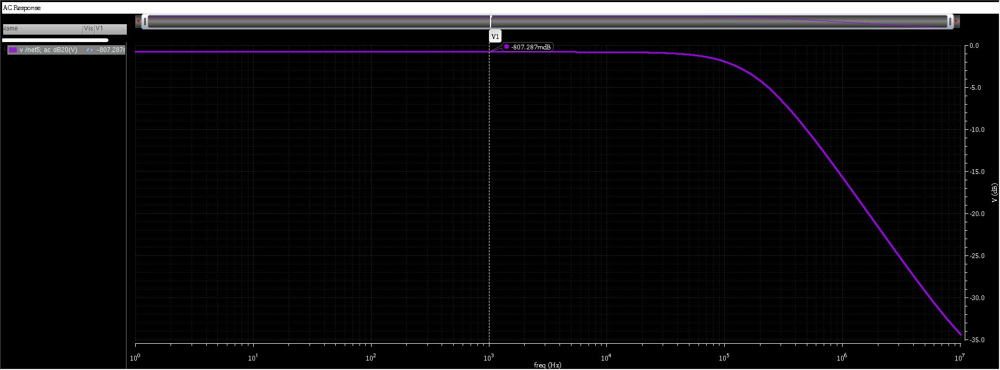
*Acm (dB) vs. frequency: flat at −0.807 dB from DC to 100 kHz, rolling off to −35 dB at 10 MHz.*

---

## 8. PSRR Simulation

**PSRR = Adm / A_supply** — how much VDD supply noise appears at the output. Real VDD rails carry switching transients, LDO ripple, and DC-DC converter noise.

### 8.1 Testbench Setup

1. Restore unity-gain feedback (VOUT → VIN+)
2. VIN− = 0.6V DC (no AC)
3. VDD: DC=1.2V, **AC magnitude=1** (perturbation on supply)
4. Run AC: 1 Hz – 10 MHz
5. Plot VOUT in **dB20** → this is A_supply(f)

> **dB20 vs dB10:** Always use `dB20 = 20·log₁₀(V)` for voltage ratios. `dB10 = 10·log₁₀(P)` is for power only. During this simulation both were plotted: dB20 gave −88.79 dB and dB10 gave −44.40 dB (exactly half). Using dB10 for PSRR gives a completely wrong answer.

### 8.2 Results

| Parameter | Value | Target | Status |
|---|---|---|---|
| A_supply at 1 kHz | −88.79 dB | — | Recorded |
| **PSRR at 1 kHz** | **164.4 dB** | > 40 dB | ✅ PASS (by large margin) |

`PSRR = 75.6 − (−88.79) = 164.4 dB`

### 8.3 Why PSRR >> CMRR

CMRR=76.4 dB, PSRR=164.4 dB — an 88 dB difference. VDD perturbation must couple through transistors to reach VOUT, and the feedback loop actively suppresses any supply-induced output error. Loop gain = 75.6 dB ≈ 6000× suppresses supply disturbances multiplicatively. Common-mode signals, by contrast, enter directly through input terminals and bypass the full loop gain benefit.

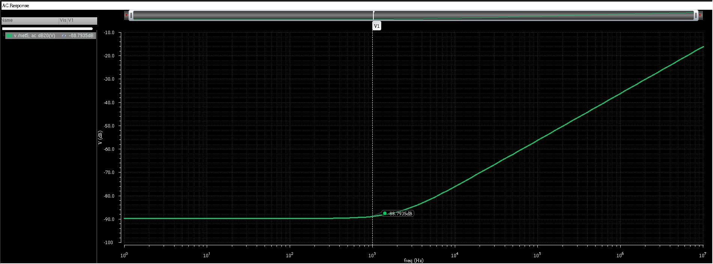
*A_supply (dB20) vs. frequency: −88.79 dB at 1 kHz, giving PSRR = 164.4 dB.*

---

## 9. Corner Sweep — ADE XL

### 9.1 Process Corner Physical Meaning

| Corner | NMOS | PMOS | Physical Meaning | Worst Case For |
|---|---|---|---|---|
| TT | Typical | Typical | Nominal transistors — design target | Baseline |
| SS | Slow | Slow | Higher Vth, lower mobility — devices conduct less | Speed (lowest GBW) |
| FF | Fast | Fast | Lower Vth, higher mobility — devices conduct more | Stability (PM risk) |
| SF / FS | Mixed | Mixed | Not available — require 64-bit full models | Offset / matching |

### 9.2 Temperature Variable Bug

A critical ADE XL gotcha discovered during corner sweep: the global variable for temperature must be named exactly **`temperature`** (all lowercase).

- `Temperature` (capital T): passes to netlist as a named parameter (`parameters Temperature=-40`) but does NOT connect to the simulator's temperature register — which stays at its default 27°C. All 9 simulation points show identical GBW and PM.
- `temp`: ADE XL rejects with the explicit message: *"Use `temperature` in order to modify simulation temperature"*
- `temperature`: correctly maps to `simulatorOptions temp=<value>`

### 9.3 Corner Sweep Results (3 Corners × 3 Temperatures)

| Corner | Temp | GBW | Phase Margin | Status |
|---|---|---|---|---|
| TT | −40°C | 91.55 MHz | 62.66° | ✅ PASS |
| TT | 27°C | 57.11 MHz | 60.88° | ✅ PASS |
| TT | 125°C | 31.44 MHz | 61.86° | ✅ PASS |
| SS | −40°C | 87.23 MHz | 62.34° | ✅ PASS |
| SS | 27°C | 48.73 MHz | 62.30° | ✅ PASS |
| SS | 125°C | 25.55 MHz | 63.70° | ✅ PASS |
| FF | −40°C | 92.49 MHz | 61.23° | ✅ PASS |
| **FF** | **27°C** | **61.73 MHz** | **56.88°** | ❌ **FAIL** |
| **FF** | **125°C** | **35.53 MHz** | **55.68°** | ❌ **FAIL** |

GBW range across all corners/temperatures: **25.5 MHz (SS/125°C) → 92.5 MHz (FF/−40°C)** — a 3.6× spread.

### 9.4 FF Corner Failure Analysis

FF corner fails PM at 27°C and 125°C. Root cause: GBW scales faster than p2 in the FF corner.

For PM ≥ 60°, need `p2 > 2.2 × GBW`. When GBW grows faster than p2, the ratio shrinks and PM falls.

```
TT/27°C:  GBW = 57 MHz,  p2 = 192 MHz,  ratio = 3.36  →  PM = 60.9°  ✅
FF/27°C:  GBW ↑ faster,  p2 grows less,  ratio shrinks  →  PM = 56.9°  ❌
FF/125°C: PMOS gm6 degrades faster with temp than NMOS gm1  →  PM = 55.7°  ❌
```

Physical reason: PMOS is hole-based transport. Hole mobility degrades more steeply with temperature than electron mobility. At 125°C, gm6 (PMOS M6) drops proportionally more than gm1 (NMOS M1/M2), reducing the p2/GBW ratio.

**Proposed fix:** Increase Cc from 1.35 pF → 1.55 pF. This lowers GBW at all corners by ×(1.35/1.55)=0.87 without changing p2. FF/27°C GBW drops from 62 → 54 MHz, restoring PM above 60°. Trade-off: TT/27°C GBW drops from 57 → ~50 MHz.

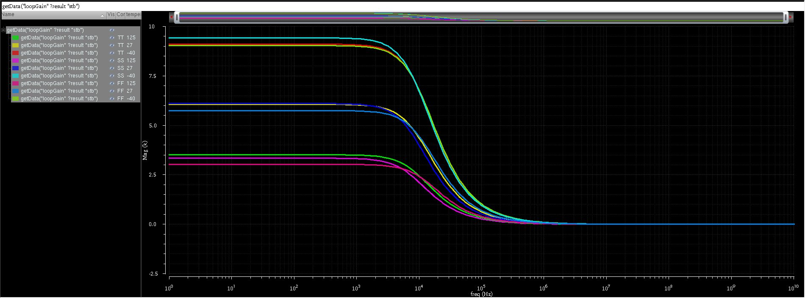
*Loop gain Bode plot — corner sweep overlay. Gain and phase vs. frequency across TT/SS/FF corners.*

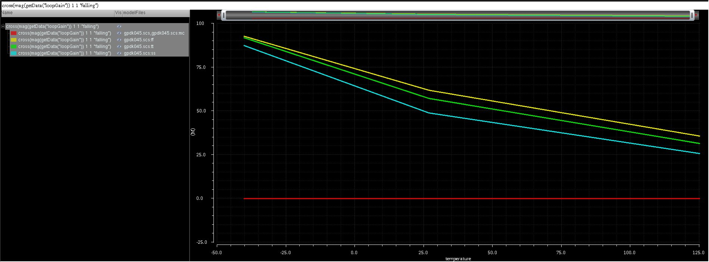
*Corner sweep — SS and FF phase margin comparison. FF corner phase margin degradation visible at GBW crossing.*

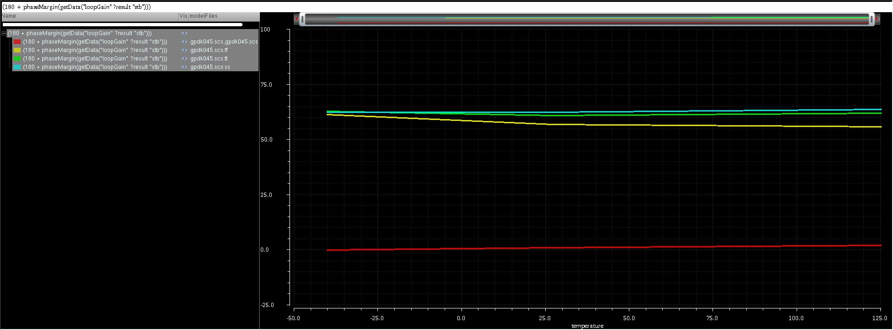
*Corner sweep across temperatures. GBW range: 25.5 MHz (SS/125°C) to 92.5 MHz (FF/−40°C).*

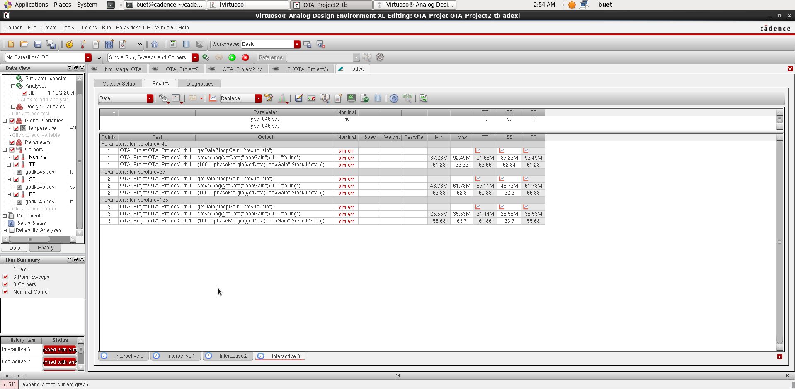
*ADE XL results table: all 9 corner/temperature simulation points with GBW and phase margin values.*

---

## 10. Monte Carlo & Offset Budget

### 10.1 Why Monte Carlo Was Not Achievable

Four separate approaches were attempted on 32-bit Spectre 12.1 — all blocked:

| Attempt | Method | Error | Root Cause |
|---|---|---|---|
| 1 | ADE XL Mismatch mode default | `SPECTRE-16011: no mismatch variations` | `0.1_models/gpdk045_mos.scs` has no statistics block |
| 2 | `vary g45n1svt(vth0) std=0.004` | `SFE-874: Unexpected '('` | Parenthesis syntax not supported in 32-bit Spectre 12.1 |
| 3 | `vary g45n1svt vth0 std=0.004` | `SFE-874: Unexpected 'std'` | Space-separated syntax also not supported |
| 4 | Full models `section=mc` (has proper statistics block) | `VACOMP-1008` + Segfault | `g45n1svt` subcircuit contains Verilog-A components requiring 64-bit VACOMP compiler |

The full GPDK045 g45n1svt model is an inline subcircuit wrapping the BSIM4 core with mismatch parameters (rn1, rn2, rp1, rp2) and a poly resistor + bsource implemented in Verilog-A. These require the 64-bit Verilog-A compiler unavailable in 32-bit Spectre 12.1.

### 10.2 Pelgrom's Law — Analytical Offset Estimate

Since Monte Carlo was not achievable, input offset is estimated analytically using Pelgrom's Law:

```
σ(ΔVth) = √2 × AVT / √(W × L)
```

| Parameter | Value |
|---|---|
| AVT (NMOS, 45nm) | ~3 mV·µm |
| AVT (PMOS, 45nm) | ~4 mV·µm |

**M1/M2 contribution (NMOS differential pair):**
```
σ(ΔVth_M1M2) = √2 × 3 / √(4µm × 0.18µm) = 4.243 / 0.849 = 4.99 mV
```

**M3/M4 contribution (PMOS active load), input-referred via gm3/gm1 ratio:**
```
σ(ΔVth_M3M4) = √2 × 4 / √(6µm × 0.18µm) = 5.45 mV  →  × (gm3/gm1) = × 0.544 = 2.96 mV
```

**Total (uncorrelated — add in quadrature):**
```
σ(Vos) = √(4.99² + 2.96²) = √33.66 = 5.8 mV
3σ = 3 × 5.8 = 17.4 mV    (Target: < 5 mV)
```

### 10.3 What It Would Take to Meet 5 mV

Working backwards: need σ(Vos) < 1.67 mV, which requires M1/M2 W ≈ 100 µm (25× current size). This creates an unavoidable conflict: 100 µm M1/M2 at 38 µA would have Vov ≈ 6 mV — deep in subthreshold where Vth mismatch itself becomes unreliable. The offset spec, GBW spec, and supply voltage cannot all be simultaneously met at 45nm with 1.2V. Real products resolve this through chopper stabilisation (bypasses random offset entirely), higher-Vt devices with larger gate area per node, or relaxed offset spec.

---

## 11. Layout Implementation

### 11.1 Layout Status

| Block | Status |
|---|---|
| M1/M2 differential pair (ABBA common-centroid) | ✅ Placed |
| M3/M4 PMOS active load | ✅ Placed |
| M5 tail current source | ✅ Placed |
| M6 second-stage amplifier (25-finger SerMos25 Pcell) | ✅ Placed — wiring defect found, see §13.5 |
| M7 second-stage load (5-finger SerMos5 Pcell) | ✅ Placed |
| M8 bias reference | ✅ Placed |
| Cc (nmoscap1v) | ✅ Placed and routed |
| Rz (ressppoly) | ✅ Placed and routed |
| DRC (Assura) | ✅ Clean — 0 violations |
| LVS (Assura) | ✅ Matched — 2 documented waivers, see §15 |
| PEX (Assura RCX) | ✅ Extracted — Cc/Rz model substitution required, see §13.7 |
| Post-PEX AC/STB | ⚠️ Bias chain verified correct in isolation; closed-loop operating point not yet settling at intended mid-rail — root-caused to §13.5, fix pending |

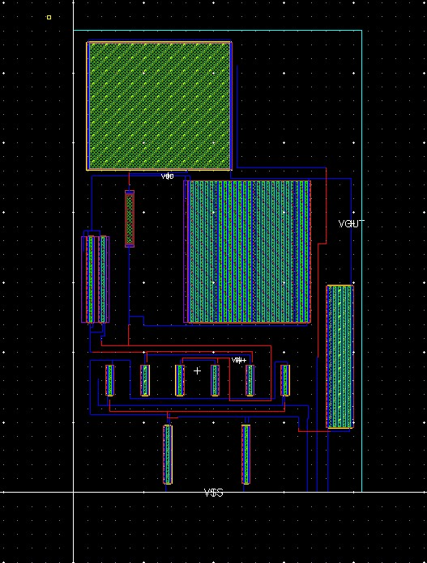
*Top-level Virtuoso layout — ABBA common-centroid differential pair, M3/M4 load, M5 tail, M6/M7 second stage, M8 bias, Cc/Rz, NMOS/PMOS guard rings.*

### 11.2 ABBA Common-Centroid for M1/M2

ABBA common-centroid placement is mandatory for the differential pair. Without it, systematic offset from process gradients cannot be cancelled.

**The problem:** Fabrication conditions vary slowly across the wafer (oxide thickness, implant dose, temperature). If M1 and M2 are placed side by side, each samples a different point on the gradient and ends up with a different Vth — a **systematic** offset that is the same direction on every chip.

**ABBA solution:** Split each transistor into two half-width fingers and interleave:

```
Position:   1      2      3      4
Device:     M1a    M2a    M2b    M1b
            (A)    (B)    (B)    (A)

M1 samples positions 1 and 4:  average = (low + high)/2  = mid
M2 samples positions 2 and 3:  average = (mid + mid)/2   = mid
```

Both transistors see the same gradient average → systematic offset cancels to first order in any direction. Dummy fingers on both outer ends (gate to VSS, source/drain to supply) ensure all active fingers have identical neighbours, eliminating edge effects.

| Mismatch Type | Cause | Fixed by ABBA? | Fixed by Larger W×L? |
|---|---|---|---|
| Systematic offset | Process gradients | ✅ Yes — first-order cancellation | ❌ No |
| Random offset | Atomic-level statistical variation (Pelgrom) | ❌ No | ✅ Yes — σ ∝ 1/√(WL) |

### 11.3 Cc Routing — Most Layout-Sensitive Component

Parasitic routing resistance on Cc directly shifts the nulling zero frequency post-PEX. Every ohm in series with Cc modifies the effective Rz:

- Place Cc physically between NET_B and VOUT to minimise wire length
- Route in Metal 3 or Metal 4 (lower sheet resistance than M1/M2)
- Avoid routing over other signal wires — use a dedicated metal route
- Every 1 µm of M2 routing ≈ 0.05–0.1 Ω additional Rz

### 11.4 Guard Rings

Two separate guard rings required:

**NMOS guard ring:** p+ substrate contact ring around all NMOS (M1, M2, M5, M7, M8) → connects to VSS. Provides low-resistance path for substrate currents; prevents coupling between NMOS devices.

**PMOS guard ring:** n-well contact ring around all PMOS (M3, M4, M6) → connects to VDD. Prevents floating n-well; reduces noise coupling between PMOS and NMOS groups.

NMOS and PMOS guard rings must be physically separate — they must not share contacts.

---

## 12. LVS Signoff & Debugging

### 12.1 Starting State

The layout was DRC-clean at a basic level, but LVS showed **42 unmatched internal nets and 7 unmatched device instances**, dominated by:

- VIN+ and VIN− pins sitting on the wrong physical net (a PMOS drain / ABBA source-drain strap) instead of on M1/M2's actual gate poly
- M3/M4 gates not tied together (net18 mismatch)
- M6 (25-finger SerMos25 Pcell) and M7 (5-finger SerMos5 Pcell) gate fingers not tied into their respective bias buses (net25, net13)
- M5 (intended as a 4µ tail-bias device) appearing only as two unconnected 2µ ABBA dummy fingers
- M8 (diode-connected bias reference) gate and drain not tied into net13

A prior post-PEX simulation attempt had shown zero loop gain across all frequencies, traced to the VIN+ pin issue above.

### 12.2 Root Cause Pattern and Fix

Across nearly every unmatched net, the root cause was the same: a gate (or shared bus) existed in the layout but had no Metal1+Contact path tying it into the intended net. GPDK045's MOS Pcells generate gate poly with a poly extension/tab beyond the active (Oxide) region specifically so an external contact can be added — these had simply never been wired up for several nets.

**Repeated fix pattern:**

1. Cross-probe the problem net in the Assura LVS results (RVE) to find its physical location
2. Identify the gate poly's extension/tab beyond the Oxide boundary
3. Extend a small Metal1 patch over this poly tab
4. Place a Cont (contact) on the poly tab, clear of the Oxide/active edge — spacing matters, see §12.3
5. Connect this Metal1 to the rest of the intended bus (e.g. the net13 strap, or the VIN+ gate strap)

| Net | Devices Tied In | Result |
|---|---|---|
| VIN+ | M1's 2 gate fingers | Fully matched |
| VIN− | M2's 2 gate fingers | Fully matched |
| net18 | M3/M4 gates | Fully matched |
| net25 | M6, all 25 gate fingers | Fully matched |
| net13 | M7 (5 fingers), M8 gate | Fully matched |

This single technique took unmatched internal nets from 42 down to single digits.

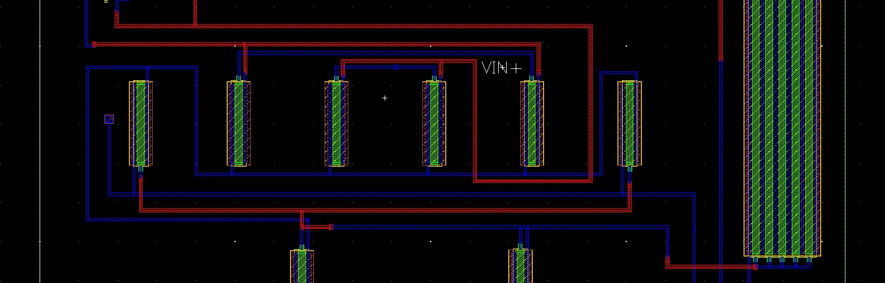
*ABBA row showing the Metal1+Cont gate-strap connections added for VIN+/VIN− on M1/M2's gate fingers.*

### 12.3 New DRC Violations From the Added Contacts

Adding the Cont+Metal1 connections above surfaced two new DRC violations:

| Rule | Description | Cause |
|---|---|---|
| CONT.SE.3 | Minimum gate Contact-on-Active-Area spacing ≥ 0.06 µm | Contact placed too close to / overlapping the gate's active (channel) region |
| METAL1.E.2 | 0.03 ≥ 0.03 µm (marginal) | Metal1 not fully enclosing the new Cont on two opposite sides |

**Fix:** Moved each affected contact further from the Oxide/Active edge, fully onto the poly extension, with margin beyond the 0.06 µm minimum. Where geometry was tight, used Virtuoso's "create via" assisted placement (auto-generates a correctly sized and spaced Cont) rather than manually drawn rectangles. DRC went clean (0 violations) at these locations afterward.

> The DRC fix here and the VIN+ extraction discrepancy below (§12.4) happened close together in time but were tracked down to be **independent issues** — fixing DRC did not, by itself, fix the deeper extraction-level connectivity gap.

### 12.4 The VIN+_avConflict Discrepancy — LVS vs RCX Extraction Mismatch

After all §12.2 fixes, LVS reported VIN+/VIN− as **fully matched**. However, every RCX (parasitic) extraction — repeated across multiple fresh runs with new view names to rule out caching — consistently showed: the bare VIN+ port connected to nothing but a 0.87 fF parasitic capacitor (effectively floating), and a separate net, **VIN+_avConflict**, carrying the real mesh of resistors/capacitors and touching the actual transistor gates.

This meant the testbench's stimulus, applied at the VIN+ port, never reached M1's gate in the extracted (post-layout) netlist — even though LVS considered the design correctly matched. This is a real, reproducible discrepancy between LVS's topological/pattern-based net matching and RCX's strict geometric extraction: **LVS can be satisfied by connectivity that doesn't form a true, continuous, fully merged conductor.**

**What fixed it:** Two changes were made close together, and the very next RCX extraction came back clean (no more `_avConflict` split, VIN+ properly meshed and reaching M1's gate directly):

- Changed the VIN+/VIN− pin shapes' layer purpose from plain "drawing" to the proper "Metal1 pin" purpose
- Added a small (~0.01 µm) additional Metal1 overlap at the VIN+ pin-to-gate-strap junction

It was not conclusively isolated which of these two changes was the deciding factor, but the combination resolved it completely and consistently across that and subsequent extractions.

> **Lesson for future debugging:** When LVS says "matched" but RCX/post-layout simulation tells a different story, don't trust LVS's report as proof of true geometric continuity. Cross-check by grepping the actual extracted netlist for the port name directly, and look for `_avConflict`-suffixed nets — Assura appends this suffix specifically when it finds two competing definitions for the same net name during flattening.

---

## 13. PEX / Post-Layout Verification

### 13.1 Tail-Node Short to VSS (net21 = VSS Bug)

With VIN+/VIN− finally working, the extracted netlist showed **net21** (the TAIL node — M1/M2's shared source, M5's drain) **completely absent**. M1, M2, and M5 all showed their source/drain terminals tied directly to VSS instead of to a distinct net21.

**Root cause:** The ABBA row's 6 NMOS fingers had all 6 sources tied onto one single shared strap, and this same strap carried a substrate Ptap connecting straight to VSS. A strap that needs to be both "the floating TAIL node" and "tied to VSS" is a direct contradiction — the entire strap collapses to VSS.

**Fix:**

| Step | Action |
|---|---|
| 1 | Removed the original Ptap from the shared strap (initially broke a LATCHUP DRC rule, since that tap also satisfied a proximity requirement) |
| 2 | Re-added a Ptap using the proven recipe — Oxide 0.2µ×0.2µ, Pimp 0.22µ×0.22µ, Cont 0.06µ×0.06µ, Metal1 0.18µ×0.18µ, all concentric — with its own independent Metal1 wire to VSS, not touching the TAIL strap |
| 3 | Physically separated the TAIL strap (M1.source + M2.source + M5.drain) from any VSS-tied metal |
| 4 | Re-ran DRC (clean), LVS, and RCX. The fresh extraction showed net21 as its own properly meshed net for the first time |

### 13.2 Missing Bias Reference Current (IREF) in the Extracted Testbench

Even with net21 fixed, the operating point showed M1, M2, and M5 all sitting in subthreshold/cutoff, with drain currents in the nanoamp range instead of the designed ~100 µA mirror-derived currents. The extracted netlist's testbench contained **no current source instance at all**.

IREF exists inside the OTA schematic itself (not the testbench) to bias M8's diode-connected reference; ideal current sources have no physical layout representation, and the BIAS node (net13) is internal to the OTA subckt — not exposed as a top-level port — so an external testbench-level IREF cannot reach it post-layout the normal way.

**Fix (netlist-level workaround):** Since net13 still exists by name inside the extracted subckt, an ideal current source was added directly inside the subckt body via direct netlist editing:

```spice
IREF_FIX (net13 VDD) isource dc=100u
```

The terminal order matters: Spectre's isource convention pushes current out of the first terminal and pulls it in at the second. The first attempt, `(VDD net13)`, produced a total loop failure (zero gain). Switching to `(net13 VDD)` produced a plausible-looking STB result (the intermediate result in §14.1). However, the deeper bias-chain investigation in §13.4 found that this same `(net13 VDD)` orientation actually left net13 at an incorrect negative voltage once checked directly — and that the originally-discarded `(VDD net13)` orientation was the physically correct one all along, but only once combined with a guiding initial condition. The full resolution is below in §13.4.

### 13.3 A Field-Reading Error: "id" vs "ids" in BSIM4 Operating-Point Data

When extracting per-device operating-point data (Id, Vgs, Vth, gm) from Spectre's `myop.info` file to diagnose the bias chain, the field position for drain current was initially located by name match on `"id"`. This field's description, when checked more carefully, reads "Resistive drain current" — a specific, narrow quantity, not the actual total channel current. The real total drain-to-source current is a separate field named `"ids"` ("Resistive drain-to-source current"), positioned earlier in the BSIM4 struct.

This error produced a misleading early read showing M8 carrying ~100 µA (matching the IREF value) with Vgs near zero — a physically impossible combination for a diode-connected device, which should have been a red flag. Re-deriving the field positions from the struct definition and re-reading with the correct `"ids"` field showed M8's actual channel current was only ~45 nA at that point, and M5's was effectively zero.

> **Lesson:** When parsing PSF info files programmatically for unfamiliar fields, always check the field's "description" property, not just its name. Similarly named fields (`id` vs `ids`) can represent materially different physical quantities, and a result that looks plausible at a glance (matching the expected current magnitude) can still be the wrong field.

### 13.4 Bistable DC Convergence and the Path to a Correct Bias Point

Continuing from the `(net13 VDD)` IREF orientation that had produced the intermediate result in §14.1, a separate, explicit `dc` analysis (with `oppoint=rawfile` so device-level data could be inspected) was added to check the bias chain directly. It showed net13 settling at approximately **−0.68 V** — deeply negative, fully explaining why M5 and M8 were not conducting properly despite the earlier plausible-looking STB margins. This is the same class of issue documented at the schematic level: a high-gain, closed-loop OTA has multiple mathematically valid DC operating points, and the solver can converge to a non-physical one without guidance.

| Attempt | Result |
|---|---|
| Add `ic I0.net13=0.55` (hierarchical initial condition) | Warning: ignored if not hierarchically qualified (bare `net13` is not a top-level node); once correctly qualified, accepted — but net13 still settled at −0.68 V using the `(net13 VDD)` IREF orientation, confirming that orientation was wrong despite the earlier plausible STB result |
| Reverse IREF polarity back to `(VDD net13)` — the orientation originally tried first and discarded in §13.2 — while keeping the `ic` statement | net13 settled at **0.5715 V** — correct, matching the documented pre-layout BIAS value of 0.568 V almost exactly. The `(VDD net13)` orientation was right all along; it simply needed the `ic` statement to find that equilibrium instead of the degenerate zero-gain one |
| Reorder netlist so `ic` and the explicit `dc` analysis run before `stb` | STB confirmed it reused the dc analysis's operating point ("operating point producer": "myop"); M8 showed ids=99.88 µA, vgs=0.568 V — correctly biased for the first time. However, STB margins were still NaN at this same point: VOUT and VIN+ had settled near 0.044 V, close to VSS, rather than mid-rail |
| Add further `ic` statements on net18, net25, and VOUT/VIN+ together, on top of the working net13 fix | No effect — VOUT/VIN+ still settled near 0.044 V regardless |
| Sweep VDD from 0 to 1.2V (continuation method, matching the schematic-level documentation's own approach to this class of problem) | Final converged point unchanged from the single-point case — the bad equilibrium persists across the whole ramp, indicating this is not simply the wrong starting guess but a structurally favoured outcome given the present circuit |

**Conclusion of this investigation:** The bias generator itself (IREF → net13 → M8) is now correctly fixed and verified (§13.2–13.3). The remaining issue is that the overall closed-loop operating point still collapses toward VOUT/VIN+ near VSS rather than mid-rail, and this persists even with strong initial-condition guidance and a full continuation sweep. This pointed investigation toward the second stage's actual drive strength, leading to the finding below.

### 13.5 Major Finding: M6 Wired as a Series Chain Instead of a Parallel Multi-Finger Device

Checking M3/M4 (the diode-connected first-stage mirror) showed both in subthreshold with tiny, matched currents — consistent with simply mirroring whatever tiny current M1 was drawing, not an independent fault. Tracing the cause further upstream to the second stage, M6's full set of 25 finger instances was extracted from the netlist and the source/drain connectivity was reconstructed by hand:

```
VDD → avC10 → avC11 → avC12 → ... → avC32 → avC33 → VOUT
```

All 25 fingers form a single, unbroken, continuous chain from VDD to VOUT. Every internal node (avC10 through avC33) is simultaneously one finger's drain and the next finger's source — there is no point at which the structure splits into a clean "these nodes are source-type, those are drain-type" pattern. **This is a genuine series stack, not a parallel comb layout with some missing straps.**

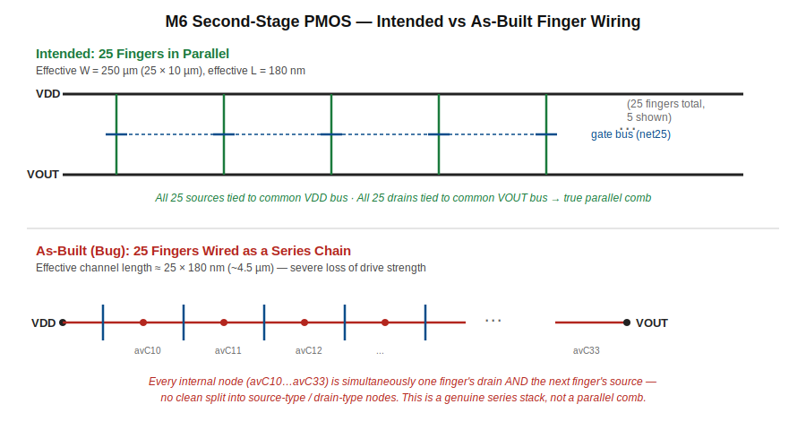
*Intended: 25 fingers in parallel, all sources to VDD, all drains to VOUT (effective W=250µm). As-built: 25 fingers in series, sharing diffusion with no separating cut (effective L ≈ 25×180nm).*

**Why this matters:** M6 is specified as a single 250 µm wide PMOS (25 fingers of 10 µm each, in parallel) for second-stage drive strength. Wired in series instead, the effective device behaves closer to one long, narrow, high-resistance transistor (effective channel length on the order of 25 × 180 nm) rather than a wide, strong pull-up. This explains why M6, despite being 5× wider than M7 and seeing a much larger gate overdrive, cannot pull VOUT up against M7's pull-down — it does not actually have anywhere near its nominal drive strength.

This is assessed as the most likely root cause of the bistable convergence behaviour in §13.4: a correctly-functioning, full-strength M6 would be expected to dominate the bias point and pull the loop toward the intended mid-rail solution; a severely weakened M6 makes the degenerate near-VSS solution far more attractive to the solver.

**Why the earlier fixes didn't help here:** The VIN+_avConflict fix (§12.4) responded to pin-purpose changes and a small Metal1 overlap because it was a marginal/borderline connectivity case. M6's series-chain structure was re-tested after marking the VDD and VOUT pins with proper Metal1 pin purpose, and the extracted netlist was byte-for-byte identical to before. This confirms the series-chain structure is a genuine, physical fact about how the diffusion is shared between adjacent fingers in the layout — not an extraction-tolerance artefact, and not fixable by the same class of small adjustment that worked for VIN+.

**What a real fix requires:** Physically separating the shared diffusion between every adjacent pair of fingers (so each finger has its own independent source and drain region instead of sharing one continuous strip with its neighbour), then wiring all 25 newly-separated source regions to a common VDD bus and all 25 drain regions to a common VOUT/net25-side bus. This is substantial layout rework — closer to rebuilding M6's diffusion structure than adding a few missing contacts — and is logged as the next concrete task (§19) rather than attempted in this session.

### 13.6 PEX / RCX Setup Notes (for repeating this process)

| Topic | Detail |
|---|---|
| Substrate naming fix | RCX's setup files hardcode the substrate net name as `psubstrate`, while the local LVS extraction names it `pwell`. A global `sed 's/psubstrate/pwell/g'` across these files (with `_BACKUP` originals preserved) is required before RCX will run without a `-cap_ground_layer` error |
| Stale view caching | Always use a fresh, never-before-used RCX output view name when testing fixes. Confirm by checking the subckt name in the generated netlist (`grep -n "subckt OTA_Project2_av_extracted" input.scs`) |
| Schematic extraction error | If LVS fails with "schematic was never extracted," open the schematic and run Check and Save before retrying |
| Reordering analyses | Spectre analyses that depend on a shared operating point (an explicit `dc` analysis and a later `stb` analysis) should be ordered so the `dc` analysis runs first; `stb` will then report "operating point producer" as the dc analysis's name and reuse its converged point rather than solving independently |

### 13.7 Post-PEX Simulation Workaround — Cc/Rz Models Unsimulatable

The PDK's `g45ncap1` (Cc) and `g45rspp` (Rz) models cannot be simulated directly post-PEX on this 32-bit installation, for reasons matching the previously documented 32-bit Monte Carlo limitation (missing process-corner derating parameters in the 32-bit model redirect).

**Working substitution procedure:**

| Step | Action |
|---|---|
| 1 | Replace the `R0 (...) ressppoly_pcell_0 ...` instance with an ideal resistor: `r=105` |
| 2 | Replace the `M0 (...) g45ncap1 ...` instance with an ideal capacitor: `c=1.357p` |
| 3 | Watch for multi-line continuations — replacing only the first line of a wrapped instance statement leaves an orphaned fragment that breaks parsing. Delete the leftover continuation line(s) too |
| 4 | Add small (1 milliohm) link resistors between PEX-split segments of what should be one electrical node (needed for the Rz/Cc junction and for VOUT in nearly every extraction) |
| 5 | Run `spectre` directly (not through ADE's interactive mode) to avoid IPC session-name issues |
| 6 | For operating-point data, add an explicit DC analysis: `myop dc oppoint=rawfile`. Always verify field positions against the struct's description text, not just its name (§13.3) |

---

## 14. Pre-Layout vs Post-Layout Results

Two distinct post-layout states were reached during this work, and both are recorded here for completeness.

### 14.1 Intermediate Result (Before Full Bias-Chain Verification)

Achieved after correcting IREF polarity, before the deeper operating-point checks in §13.3–13.5 revealed the bias chain was not yet fully settled:

| Metric | Pre-Layout (Schematic) | Post-Layout (Intermediate) |
|---|---|---|
| DC Loop Gain | 75.6 dB | ~44.4 dB |
| Phase Margin | 60.9° | 50.6° |
| Gain Margin | Not separately recorded | 17.9 dB |
| GBW (unity crossover) | 57.5 MHz | ~29.8 kHz |

> No waveform capture exists for this intermediate point — values were read directly from the Spectre output log / calculator, not plotted.

### 14.2 Final, Most Rigorously Verified State

After confirming net13 = 0.5715 V (matching documented BIAS = 0.568 V) and M8 = 99.88 µA (matching the IREF reference) via corrected `ids` field readings and proper analysis ordering, STB analysis showed the closed loop collapsing to a degenerate near-VSS operating point (loop gain effectively zero, no usable margins), now root-caused to the M6 series-chain structural issue in §13.5.

**Status:** The bias generator chain (IREF → M8 → M5 → M1/M2 tail) is confirmed correct and working in isolation. The second stage (M6) is confirmed to be the limiting structural problem preventing the closed loop from settling at its intended operating point. A clean, fully-passing post-PEX AC/STB result is expected once the M6 finger rework (§19) is complete.

---

## 15. Known Limitations & Documented Waivers — Physical Design

| Limitation | Impact | Root Cause |
|---|---|---|
| M0.B (Cc's bulk): VOUT (schematic) vs VSS (layout) | Flagged by LVS as a bad net connection on M0 | The `nmoscap1v` Pcell's schematic symbol has no exposed B pin; B is internally tied to S/D=VOUT in the symbol. Documented waiver, no fix needed |
| M5/M8 merge artifact in LVS | NM2 reported as merged result of three layout instances; width shown as 8µ vs schematic's 4µ | The two repurposed ABBA dummy fingers (M5) sit in the same diffusion run as M8; an LVS reporting/grouping artifact from the physical diffusion layout choice, not a real device-level short |
| M6 wired as a 25-stage series chain instead of a parallel 250 µm device | Second stage has far less drive strength than intended; identified as the primary cause of the closed-loop bias point collapsing to a degenerate near-VSS solution | Adjacent fingers share continuous diffusion regions with no separating cut and no independent VDD/VOUT strapping. Requires diffusion-separation layout rework across all 25 fingers — logged as the next concrete task (§19) |

---

## 16. Results Summary

| Simulation | Parameter | Measured | Target | Status |
|---|---|---|---|---|
| DC | All signal-path devices in saturation | Yes (M5 triode — accepted) | Yes | ✅ |
| DC | VOUT at mid-rail | 0.600 V | 0.600 V | ✅ |
| DC | M1/M2 current match | 38.1 vs 37.98 µA | Matched | ✅ |
| DC | M6/M7 current match | 1.254 mA both | Matched | ✅ |
| AC | DC open-loop gain | 75.6 dB | > 60 dB | ✅ |
| AC | GBW | 57.5 MHz | > 100 MHz | ⚠️ |
| AC | Phase margin (TT/27°C) | 60.9° | > 60° | ✅ |
| Transient | SR rising | 64.5 V/µs | > 20 V/µs | ✅ |
| Transient | SR falling | 55 V/µs | > 20 V/µs | ✅ |
| Transient | Settling time rising (0.1%) | 18.6 ns | < 100 ns | ✅ |
| Transient | Settling time falling (0.1%) | 223 ns | < 100 ns | ❌ |
| Noise | Flicker corner | 1.4 MHz | — | — |
| Noise | Thermal noise floor | 9.5 nV/√Hz | — | — |
| Noise | Integrated RMS | ~107 µV | — | — |
| CMRR | CMRR at 1 kHz | 76.4 dB | > 60 dB | ✅ |
| PSRR | PSRR at 1 kHz | 164.4 dB | > 40 dB | ✅ |
| Corner | PM — TT / all temps | 60.9° – 61.9° | > 60° | ✅ |
| Corner | PM — SS / all temps | 62.3° – 63.7° | > 60° | ✅ |
| Corner | PM — FF / −40°C | 61.2° | > 60° | ✅ |
| Corner | PM — FF / 27°C | 56.9° | > 60° | ❌ |
| Corner | PM — FF / 125°C | 55.7° | > 60° | ❌ |
| Offset | 3σ input offset (Pelgrom) | ~17.4 mV | < 5 mV | ❌ |
| Layout | All devices placed | Yes | — | ✅ |
| DRC | Assura DRC | 0 violations | Clean | ✅ |
| LVS | Assura LVS | Matched (2 waivers) | Clean | ✅ |
| PEX | RCX extraction | Complete (model substitution used) | — | ✅ |
| Post-PEX | DC loop gain (intermediate) | ~44.4 dB | 75.6 dB (pre-layout) | ⚠️ |
| Post-PEX | Closed-loop bias point (final, verified) | Collapses near VSS | Mid-rail | ❌ — root cause identified, fix pending |

---

## 17. Engineering Discussion — Design Limitations

### GBW (57.5 MHz vs 100 MHz target)
A fundamental constraint of 1.2V supply + 10pF load in 45nm. The three compounding limits (gm1 headroom, Miller loading, p2 ceiling) were all explored — each fix to one spec degrades another. The 57.5 MHz / 60.9° result is the best achievable tradeoff in this design space.

### Falling settling time (223 ns vs 100 ns target)
Caused by the pole-zero doublet from imperfect Rz-Cc cancellation — a known artefact of Miller compensation with a fixed resistor. It scales with GBW: higher GBW would reduce the doublet time constant. Addressable by trimming Rz to exactly 1/gm6 or using an active replica cancellation circuit.

### FF corner PM failure
Systematic, not random — GBW scales faster than p2 in the FF corner. Fix: increase Cc from 1.35 pF to ~1.55 pF, accepting ~12% lower GBW at TT.

### Monte Carlo not run
32-bit Spectre 12.1 environment limitation. Pelgrom's Law gives 17.4 mV 3σ estimate. To be verified with 64-bit Monte Carlo in a full PDK environment.

### Input offset (17.4 mV vs 5 mV target)
M1/M2 at W=4µm is too small for good matching at 45nm. Meeting 5 mV requires W≈100µm which creates a subthreshold headroom conflict at 1.2V. Resolution: chopper stabilisation or relaxed offset spec.

### LVS-vs-RCX connectivity discrepancy (VIN+_avConflict)
LVS's topological pattern matching and RCX's strict geometric extraction are not equivalent checks — a net can be LVS-matched while still being electrically split in the extracted parasitic netlist. Caught only by directly grepping the extracted netlist for the port name rather than trusting the LVS pass/fail report alone.

### Bistable DC convergence post-layout
The same class of issue documented at the schematic level (a high-gain closed-loop amplifier has multiple mathematically valid DC solutions) reappeared post-layout, compounded by a genuine structural defect (M6 series chain) rather than just a solver-guidance problem. Initial conditions and continuation sweeps alone could not overcome a structurally weakened second stage — this is the key engineering takeaway: simulator convergence behaviour can be a symptom of a real physical-layout defect, not just a numerical nuisance.

### M6 series-chain wiring defect (open item)
The most significant finding of the post-layout phase. A Pcell-generated 25-finger device shared continuous diffusion between adjacent fingers with no separating cut, turning an intended wide parallel device into an effective long, narrow, high-resistance one. Confirmed as a genuine physical/geometric fact (not an extraction-tolerance artefact) by re-testing after pin-purpose fixes that resolved a different, similar-looking issue (VIN+_avConflict) — those fixes had zero effect here, proving the two were different classes of problem.

---

## 18. Environment & 32-bit Workarounds

Running Cadence IC615 on CentOS 6 32-bit required several non-obvious fixes:

| Issue | Fix |
|---|---|
| Full GPDK045 models use Verilog-A subcircuits (g45n1svt/g45p1svt) → segfault on 32-bit Spectre | Redirect all model sections in `gpdk045.scs` to `0.1_models/` PTM BSIM4 files (no Verilog-A) |
| Model name mismatch: schematics use `g45n1svt`, `0.1_models` defines `gpdk045_nmos1v` | Insert BSIM4 parameter block copies with g45n1svt/g45p1svt aliases into NN, SS, FF sections of `0.1_models/gpdk045_mos.scs` |
| Monte Carlo — full models required for statistics block | Not achievable; estimated analytically via Pelgrom's Law |
| ADE XL temperature sweep fails silently | Variable must be named exactly `temperature` (lowercase) — `temp` or `Temperature` cause silent errors |
| AHDL compiler memory issues | `CDS_CMI_COMPLEVEL=0` added to `~/.bashrc` |
| SFE-874 from duplicate model file entries | Remove all extra entries from Setup → Model Libraries; keep only one correct path |
| RCX hardcodes substrate net name as `psubstrate`; local extraction uses `pwell` | Global `sed 's/psubstrate/pwell/g'` across RCX setup files (originals backed up with `_BACKUP` suffix) |
| Post-PEX Cc (`g45ncap1`) / Rz (`g45rspp`) models unsimulatable on 32-bit — missing corner-derating parameters | Substitute ideal `r=105` / `c=1.357p` elements directly in the extracted netlist; run `spectre` directly rather than through ADE's interactive mode to avoid IPC session-name issues |
| BSIM4 `myop.info` field `"id"` ≠ total channel current | Use field `"ids"` ("Resistive drain-to-source current"); always check the field's description text, not just its name |

---

## 19. Next Steps

- Rework M6's layout to physically separate the shared diffusion between every adjacent finger pair, then strap all 25 sources to VDD and all 25 drains to net25/VOUT in true parallel
- After the M6 rework, re-run LVS → RCX → the Cc/Rz substitution procedure (§13.7) → STB, expecting the closed loop to now settle at the intended mid-rail operating point without needing forced initial conditions
- Capture a clean post-PEX AC/STB waveform once the above is complete
- Move to scoping Projects 2–5 once Project 1's documentation is finalised, treating the M6 rework as a tracked follow-up rather than a blocker

---

## Key Equations Quick Reference

| Parameter | Formula | This Design |
|---|---|---|
| GBW | `gm1 / (2π·Cc)` | 601µA / (2π × 1.35pF) = 70.8 MHz (theoretical) |
| p2 | `gm6 / (2π·CL)` | 12.07mA / (2π × 10pF) = 192 MHz |
| PM ≥ 60° | `p2 > 2.2 × GBW` | 192 > 126.5 ✅ |
| Ideal Rz | `1/gm6` | 1/12.07mA = 83 Ω → used 100 Ω |
| Flicker corner | `(Vnoise_1Hz / Vthermal)² × 1Hz` | (11391/9.5)² = 1.44 MHz |
| Pelgrom sigma | `√2 × AVT / √(W·L)` | √2 × 3mV / √(4u × 0.18u) = 4.99 mV per pair |

---

## Supporting Documents

| File | Contents |
|---|---|
| [`OTA_Simulation_Report_AC_DC.docx`](OTA_Simulation_Report_AC_DC.docx) | Formal simulation report — DC operating point, AC/STB results, debug history |
| [`OTA_Simulation_Study_Guide_v2.docx`](OTA_Simulation_Study_Guide_v2.docx) | Complete study guide — all simulations, equations, interview prep, environment notes |
| [`Project1_Layout_LVS_PEX_Guide.docx`](Project1_Layout_LVS_PEX_Guide.docx) | Full layout/LVS/PEX debugging log — net-matching fixes, LVS-vs-RCX discrepancy, bias-chain investigation, M6 structural finding |
