# 6T SRAM Bit-Cell, Array, and Read Path — GPDK045 45nm

**Tool:** Cadence Virtuoso IC615 · Spectre MMSIM121 · ADE L / ADE XL · Assura DRC / LVS / RCX
**PDK:** GPDK045 v5.0 · 45nm
**OS:** CentOS 6 32-bit Linux · VMware Workstation Pro
**Library:** `OTA_Projet` · Cells: `sram_6t`, `precharge_eq`, `sense_amp`, `sram_4x4_array` (extended to 8×8), `array_read_path_tb`

> **Project 4 of 5** in a mixed-signal IC design portfolio targeting Analog Layout and Physical Design Engineer roles.

---

> **Project narrative:** A complete 6T SRAM bit-cell — sized from first principles, characterized for Read/Hold SNM and Write Margin across all process corners and temperatures, verified for statistical yield via Monte Carlo mismatch, laid out with correct mirror symmetry for diffusion and power-rail sharing, extended into a real 8×8 array, and integrated end-to-end with a precharge/equalization circuit and a sense amplifier into a fully validated read path — in both schematic and post-layout (PEX-extracted) form. Along the way, a significant internal discrepancy was found and resolved: an earlier-reported nominal Read SNM value (120.3mV) turned out to be a stale artifact from a Monte Carlo script, corrected to the true value (140.0mV) using three independent cross-checks. The most significant array-level finding came from debugging the full read-path integration: a missing supply-voltage parameter (found only by directly reading the extracted netlist) and a too-tight sense-amp isolation timing window that caused the schematic and post-layout simulations to resolve to *opposite* digital polarities for the same stored bit — traced to real, physical layout-level asymmetry dominating over an undersized trapped signal. Both issues were root-caused and fixed, yielding a consistent, correct, fully validated read path at real array scale.

---

## Table of Contents

1. [What Is a 6T SRAM Bit-Cell and Why Build One](#1-what-is-a-6t-sram-bit-cell-and-why-build-one)
2. [Design Specifications](#2-design-specifications)
3. [Circuit Topology — Sizing Derivation](#3-circuit-topology--sizing-derivation)
4. [Schematic Entry and Debug History](#4-schematic-entry-and-debug-history)
5. [SNM Simulation Methodology](#5-snm-simulation-methodology)
6. [Read SNM Results](#6-read-snm-results)
7. [Hold SNM Results](#7-hold-snm-results)
8. [Write Margin — Methodology and Results](#8-write-margin--methodology-and-results)
9. [Monte Carlo Yield Study](#9-monte-carlo-yield-study)
10. [Transient Functional Verification (Pre-Layout)](#10-transient-functional-verification-pre-layout)
11. [Bit-Cell Layout](#11-bit-cell-layout)
12. [Post-Layout Re-Verification](#12-post-layout-re-verification)
13. [Precharge / Equalization Circuit](#13-precharge--equalization-circuit)
14. [Sense Amplifier](#14-sense-amplifier)
15. [4×4 and 8×8 Array Construction](#15-4x4-and-8x8-array-construction)
16. [Array Capacitance Extraction and Access Time](#16-array-capacitance-extraction-and-access-time)
17. [Full Read-Path Integration Test](#17-full-read-path-integration-test)
18. [Results Summary](#18-results-summary)
19. [Key Engineering Learnings](#19-key-engineering-learnings)
20. [Known Limitations and Future Work](#20-known-limitations-and-future-work)
21. [Environment and 32-bit Workarounds](#21-environment-and-32-bit-workarounds)

---

## 1. What Is a 6T SRAM Bit-Cell and Why Build One

A 6-transistor SRAM cell is the fundamental storage element of on-chip cache and embedded memory. It consists of two cross-coupled CMOS inverters (PD1/PU1 and PD2/PU2) forming a bistable latch, plus two NMOS access transistors (PG1, PG2) that connect the internal storage nodes Q and QB to the bit lines (BL, BLB) under control of the word line (WL).

Unlike a general-purpose logic inverter, the pull-down (PD), pass-gate (PG), and pull-up (PU) transistors cannot be sized independently. During a READ, the pass-gate and pull-down form a resistive divider at the storage node — PG must be weak relative to PD or the disturbance can flip the cell. During a WRITE, the same pass-gate must be strong relative to PU to force the node to flip. These are opposing requirements on the same transistor, which is why 6T sizing is expressed as two ratios (Cell Ratio and Pull-up Ratio) rather than three independent widths.

**Why this project demonstrates depth:** SRAM design requires simultaneous mastery of device-level stability analysis (SNM), statistical yield methodology (Monte Carlo mismatch), layout matching for diffusion/power-rail sharing at array scale, and mixed-signal periphery design (precharge, sense amplification) — all verified across process corners, temperature, and both schematic and post-layout (PEX-extracted) domains.

---

## 2. Design Specifications

| Parameter | Target | Measured | Status |
|---|---|---|---|
| Supply voltage VDD | 1.2V | 1.2V | ✅ PASS |
| Technology | GPDK045, L=45nm minimum, all devices | L=45nm | ✅ PASS |
| Read SNM (nominal, TT/27°C) | Maximize within area budget | 140.0mV | ✅ PASS |
| Read SNM (worst corner) | > 200mV at SS/125°C | 124.5mV (SS/125°C) | ❌ FAIL (documented, §20) |
| Read SNM (worst overall corner/temp) | — | 53.6mV (SF/125°C) | Recorded |
| Hold SNM (nominal) | — | 303mV | ✅ Recorded |
| Write Margin (VDD − trip, nominal) | Minimise | 0.703V | ✅ PASS |
| Monte Carlo yield (SNM > 100mV) | > 99% | 98.5% | ⚠️ Marginal (within sampling noise) |
| DRC (bit-cell, array) | Clean | 0 violations | ✅ PASS |
| LVS (bit-cell, array) | Clean | Matched (32 expected Q/QB warnings at array level) | ✅ PASS |
| Full read-path integration | Correct digital resolution | PASSED (schematic + post-layout) | ✅ PASS |

---

## 3. Circuit Topology — Sizing Derivation

### 3.1 Final Locked Sizing

| Device | Type | Role | Width | Length |
|---|---|---|---|---|
| PD1, PD2 | NMOS | Pull-down (holds stored '0') | 450nm | 45nm |
| PG1, PG2 | NMOS | Pass-gate / access transistor | 180nm | 45nm |
| PU1, PU2 | PMOS | Pull-up (holds stored '1') | 120nm | 45nm |

**Cell Ratio (CR) = PD/PG = 450/180 = 2.5**
**Pull-up Ratio (PR) = PU/PG = 120/180 = 0.67**

This sizing is the end point of a documented sweep (§6.2, §8.2) and a Monte Carlo yield study (§9), not an upfront guess.

### 3.2 The Read-Disturb Mechanism (Why CR > 1)

During a read, WL asserts and both bit lines are pre-charged to VDD. Consider a cell storing Q=0/QB=1. Node Q is held low by PD1 — but the moment WL turns on PG1, PG1 has VDD sitting on its other side (from the pre-charged BL). PG1 and PD1 form a resistive voltage divider at node Q, not a series path to one destination. Current flows from BL through PG1 into Q, down through PD1 to ground — but that current flowing through PD1's 'on' resistance causes a real voltage drop, so Q does not stay at a clean 0V; it rises to a value set by the ratio of PD1's strength to PG1's strength. If PG1 is too strong relative to PD1, Q rises high enough to cross the trip point of the opposite inverter and the cell flips — the read itself has destroyed the stored data.

```
Cell Ratio: CR = W_PD / W_PG      constraint: CR > 1 (typ. 1.5-2.5+)
```

### 3.3 The Write-Fight Mechanism (Why PR < 1)

To write a 0 into a cell holding Q=1 (held by PU1), BL is driven to 0V and WL asserts. PG1 and PU1 now fight at node Q — PU1 holding Q high, PG1 pulling it low. For the write to succeed, PG1 must win. This is the opposite requirement to §3.2: read stability wants PG *weak* relative to PD; write-ability wants PG *strong* relative to PU. Same transistor, two different opponents.

```
Pull-up Ratio: PR = W_PU / W_PG    constraint: PR < 1
```

**Why PR < 1 (not PR ≈ 1) has built-in margin:** a PMOS carries less drive current than an NMOS of the same width (lower hole mobility). The true 50/50 electrical tie point between PG and PU is estimated to sit near PR≈2, not PR=1 — confirmed empirically: even at PR=1.0, the write transition remained sharp and decisive, not marginal (§8.2).

### 3.4 Why Uniform Scaling Does Nothing

If PD, PG, and PU are all scaled up together, CR and PR — both ratios — are unchanged, so read stability and write-ability are unaffected; only area cost increases. The only way to change electrical behaviour is to size the three devices *unequally* relative to each other.

---

## 4. Schematic Entry and Debug History

### 4.1 Netlist Mapping

PG is the fixed reference width; PD = CR × W_PG; PU = PR × W_PG. Cross-coupled wiring: PD1/PU1 drain and PG1 source → Q; PD2/PU2 drain and PG2 source → QB; PD1/PU1 gate ← QB; PD2/PU2 gate ← Q; PG1/PG2 gate ← WL; PG1 drain ← BL; PG2 drain ← BLB. All NMOS bulk → VSS, all PMOS bulk → VDD.

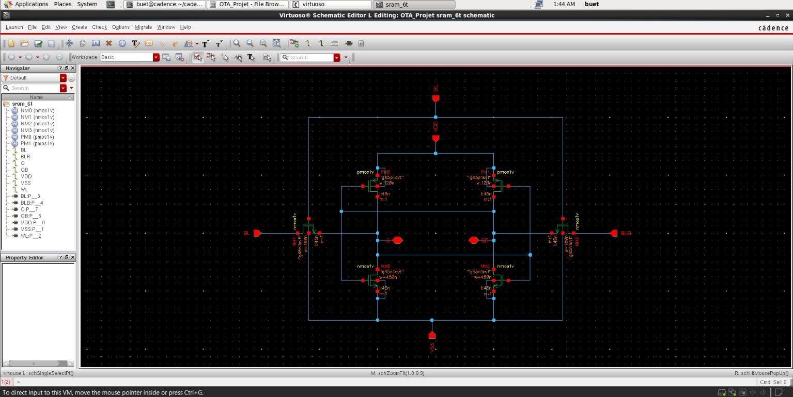
*sram_6t schematic — cross-coupled inverters (PD1/PU1, PD2/PU2) and access transistors (PG1, PG2), Q/QB/BL/BLB/WL labelled.*

### 4.2 Bistability — Why Cross-Coupling (Not Self-Looping) Stores Data

Each inverter's gate is driven by the *other* inverter's output, not its own. This positive-feedback loop gives the cell two stable states instead of one. A thought experiment: if an inverter's output were tied to its own input (no cross-coupling), forcing Q to 0V and releasing it would cause Q to drift to the inverter's own switching threshold (~VDD/2) and sit there — a single, unstable, noise-sensitive equilibrium, not a stored bit. Cross-coupling converts this into two genuinely stable, noise-resistant rails.

### 4.3 Sign-off

Schematic and generated symbol both passed Check-and-Save with zero errors on first full review.

---

## 5. SNM Simulation Methodology

### 5.1 Why the Loop Must Be Broken

Node Q's driver (QB) is not a free, independently controllable input — it is the output of the other inverter, itself influenced by the whole cross-coupled loop. The correct technique places independent ideal DC voltage sources directly on Q and QB (in two separate half-circuit branches, sharing only VDD/VSS and, for Read SNM, the fixed BL/BLB/WL bias sources), overriding the loop's own drive with the source's near-zero output impedance.

### 5.2 The Butterfly Curve — Axis Transpose, Not Point-Inversion

Run 1 forces Q, reads QB. Run 2 forces QB, reads Q. To overlay both on a common Q(X)/QB(Y) plane, one branch must be axis-transposed (swap X/Y — a reflection across the diagonal), **not point-inverted** through the centre (VDD/2, VDD/2). Point-inversion only equals a true transpose for a perfectly *symmetric* inverter VTC; this cell's PU/PD/PG are deliberately asymmetric, so point-inversion introduces real distortion (§9.3).

For a perfectly symmetric (nominal, no-mismatch) cell, one inverter's curve can be self-transposed to stand in for the other side — a valid shortcut for nominal/corner work, **not valid under Monte Carlo mismatch**, where the two halves can no longer be assumed identical.

### 5.3 Extracting SNM — Rotated-Axis Method

SNM is the side length of the largest square inscribable in one "eye" of the butterfly curve. Rotate both branches 45°: `u=(x-y)/√2`, `v=(x+y)/√2`. The maximum vertical gap between the two rotated curves, divided by √2, gives SNM directly.

### 5.4 Read vs Hold Bias Conditions

| Condition | WL | BL | BLB |
|---|---|---|---|
| Read SNM | VDD | VDD | VDD |
| Hold SNM | 0V | don't care | don't care |

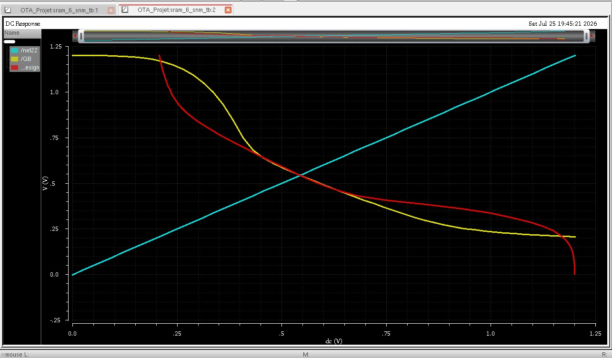
*Butterfly curve — Read SNM at nominal (TT/27°C), final locked sizing (CR=2.5).*

---

## 6. Read SNM Results

### 6.1 Nominal Result

**Read SNM (TT, 27°C, CR=2.5, PD=450n): 140.0mV.** See §9.4 for the full history of how this value was established and corrected from an earlier incorrect figure (120.3mV).

### 6.2 Cell Ratio Sweep

| PD width | CR | Read SNM |
|---|---|---|
| 240nm | 1.33 | 77.6mV |
| 300nm | 1.67 | 101.8mV |
| 360nm | 2.00 | 120.3mV |
| 450nm (locked) | 2.50 | 140.0mV |

SNM rises monotonically with CR — a stronger PD relative to PG resists the read-disturb divider (§3.2). Note: 120.3mV is the correct value for CR=2.0 — this number was, for a period, also mistakenly reported as the CR=2.5 nominal (§9.4).

### 6.3 Corner / Temperature Table (Final, CR=2.5)

| Corner | −40°C | 27°C | 125°C |
|---|---|---|---|
| MC/TT (nominal) | 190.6 | 140.0 | 82.9 |
| SS | 231.1 | 180.3 | 124.5 |
| FF | 133.7 | 77.1 | 85.2 |
| SF | 170.2 | 115.1 | **53.6 (worst case)** |
| FS | 194.4 | 140.2 | 80.4 |

**Worst case: SF @ 125°C = 53.6mV.** Against the project's target (> 200mV at SS/125°C), the measured SS/125°C value (124.5mV) falls short by ~75mV — see §20.

**Why SS/FF cancel for Read SNM but SF/FS don't:** Corners move all devices of one type together. Since CR is an NMOS-vs-NMOS ratio (PD/PG), SS/FF largely cancel out — both devices weaken or strengthen proportionally, and the ratio holds. SF/FS shift NMOS and PMOS in *opposite* directions; since PR is an NMOS-vs-PMOS ratio, these are the corners that threaten write-ability specifically (§8.3), though the read-side interaction here shows SF as the worst Read SNM corner at high temperature.

---

## 7. Hold SNM Results

| Sizing | Hold SNM |
|---|---|
| CR=1.67 (PD=300n) | 312mV |
| CR=2.5 (PD=450n, final) | 303mV |

### Corner / Temperature Table (Final, CR=2.5)

| Corner | −40°C | 27°C | 125°C |
|---|---|---|---|
| MC (nominal) | 334.3 | 303.3 | 268.7 |
| SS | 371.4 | 342.5 | 309.2 |
| FF | 290.9 | 256.7 | **220.0 (worst case)** |
| SF | 324.0 | 291.5 | 256.3 |
| FS | 336.1 | 304.5 | 269.6 |

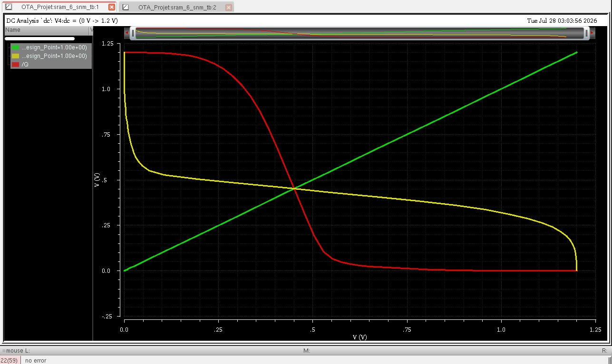
*Hold SNM butterfly curve — WL=0, storage nodes isolated from BL/BLB.*

Hold SNM is roughly 2× Read SNM at CR=2.5, consistent with the read-disturb divider (§3.2) not existing when WL=0 — nothing external can disturb Q/QB in hold, so it is never the risky condition.

---

## 8. Write Margin — Methodology and Results

### 8.1 Testbench and Convention

Write Margin uses the natural closed-loop cell (no forcing sources) — WL=VDD, BLB fixed at the opposite rail from the intended write value, BL swept from VDD to 0V. A DC nodeset (Q=1.2V, QB=0V) seeds the solver into the correct starting state. Reported as **VDD − trip_point**; a **smaller** value is better (BL barely has to move before the write succeeds — robust against real-world driver resistance and IR drop). A real write driver always drives BL fully to 0V; the margin describes how much non-ideality the write path can absorb before failing.

### 8.2 Nominal Result and Pull-up Ratio Sweep

| PU width | PR | Trip point | Write Margin (VDD−trip) |
|---|---|---|---|
| 120nm (locked) | 0.67 | 0.497V | **0.703V** |
| 150nm | 0.83 | 0.506V | 0.694V |
| 180nm | 1.00 | 0.486V | 0.714V |

PR=1.0 still produced a sharp, decisive flip rather than a marginal one — consistent with the true electrical 50/50 tie sitting above PR=1 (§3.3).

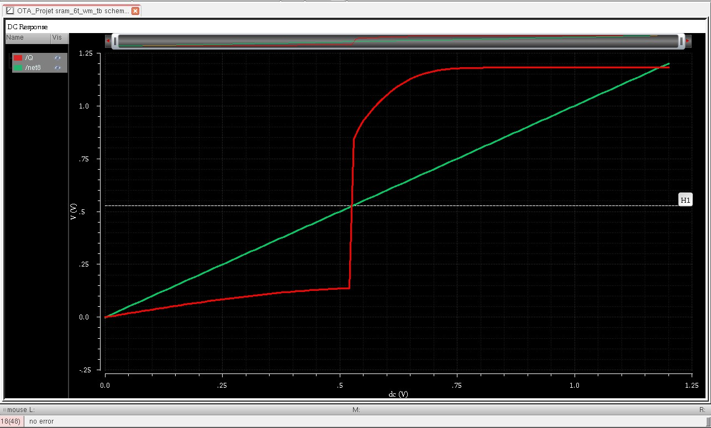
*Write Margin trip-point curve — Q vs. swept BL, nominal TT/27°C, final sizing.*

### 8.3 Corner / Temperature Table (VDD−trip, V, Final CR=2.5)

| Corner | −40°C | 27°C | 125°C |
|---|---|---|---|
| MC (nominal) | 0.763 | 0.703 | 0.653 |
| SS | 0.773 | 0.723 | 0.683 |
| FF | 0.703 | 0.632 | **0.513 (easiest write)** |
| SF | 0.743 | 0.692 | 0.633 |
| FS | 0.733 | 0.672 | 0.613 |


*Write Margin across all 5 corners × 3 temperatures at the final CR=2.5 sizing.*

At the earlier CR=1.67 sizing, FF@125°C failed to converge via the DC-sweep method (the solver settled near VDD/2 instead of a true Q=1 state, even with a two-node nodeset). At the final CR=2.5 sizing, this corner converged cleanly (0.513V) — the convergence issue did not recur. Separately, the underlying functional concern for the historical CR=1.67 case was independently confirmed via a transient-based write test (pulsed WL/BL, transient IC instead of DC nodeset) at FF/125°C, which showed a clean write (Q: 1.2V → ~0V).

---

## 9. Monte Carlo Yield Study

### 9.1 What Monte Carlo Varies

Corners move every device of one type together (fully correlated — a die that came out globally "fast" or "slow"). Monte Carlo perturbs **each transistor independently and randomly** via Pelgrom's Law: `σ(Vth) = Avth / √(W×L)`. Avth = 4mV·µm used throughout — a generic 45nm placeholder, not sourced from this PDK's own characterisation data. Because the two inverter halves can no longer be assumed identical, both sweeps must be run for real per iteration — the symmetric-cell shortcut (§5.2) does not apply.

### 9.2 Understanding the Distribution — Mean, Sigma, Z-score, Yield

A 200-run Monte Carlo produces 200 different SNM values, not one number. The **mean** is the average; the **standard deviation (σ)** is the typical distance any individual cell wanders from that average. The **Z-score** answers: how many σ's does the 100mV safety threshold sit from the mean? `Z = (mean − threshold) / σ`. Z=2.33 corresponds to roughly the 99th percentile of a normal distribution — the basis for the 99% yield target.

**Key lesson from this project's own data:** at CR=1.67, the mean (100.6mV) sat only 0.6mV above the 100mV threshold (Z=0.05) — meaning ~half the population fell below the line, for a true yield of only ~55%, despite the single nominal number looking comfortably safe in isolation. Reducing σ alone barely helps when the mean sits on the threshold: halving σ from 12.7 to 6.35mV only moved yield from 55% to ~54%. The only real fix is raising the **mean** (via CR).

### 9.3 Debug History — Point-Inversion Extraction Bug

An early Monte Carlo script built the second butterfly branch via point-inversion (`VDD−QB`, `VDD−V5`) rather than axis transpose. This gave a nominal (no-mismatch) SNM of ~141.5mV against the then-believed 101.75mV baseline (CR=1.67) — a ~40mV discrepancy that exposed the bug (point-inversion is invalid for this deliberately asymmetric cell, §5.2). Corrected to axis-transpose; nominal recomputed to 100.6mV, within 1.2% of the verified baseline.

### 9.4 Debug History — The 120.3mV vs 140.0mV Nominal SNM Discrepancy (Major)

For a period, the CR=2.5 nominal Read SNM was reported as 120.3mV, sourced from a Monte Carlo script's histogram summary. An independent corner-sweep re-verification at CR=2.5 consistently gave 140.0mV instead — reproduced identically across four separate re-exports, independent of corner-section label (TT vs MC), ruling out randomness or export artifacts.

Investigation ruled out several hypotheses: mismatch-section confusion (result was deterministic, not random), incomplete sizing updates in the open-loop testbench (sizing confirmed correct), and a competing claim that the open-loop testbench's pass-gates were incorrectly diode-connected (checked directly against the schematic and found false — gate and drain were on two separate, independently-driven nets at the same voltage value, not the same net).

**Definitive resolution:** the exact testbench independently verified to reproduce the known-good 101.75mV baseline at CR=1.67 was run directly at PD=450n with no Monte Carlo script involved. Result: 139.99mV, matching the corner sweep almost exactly. Further corroborated by extrapolating the original, independently-measured CR sweep trend (§6.2), which projects to ~148mV at CR=2.5 — close to the confirmed 140mV, entirely independent of the disputed testbenches.

**Conclusion: 140.0mV is correct, confirmed via three independent methods.** The 120.3mV figure was a stale value from the Monte Carlo script's summary printout and has been retired.

### 9.5 CR-vs-Yield Study (200 runs each, TT/27°C)

| CR | PD width | Nominal SNM (as understood at the time) | MC Mean | Std Dev | Yield (SNM>100mV) |
|---|---|---|---|---|---|
| 1.67 | 300nm | 100.6mV | 100.6mV | 12.7mV | 55.0% |
| 2.00 | 360nm | 110.3mV | 110.7mV | 11.5mV | 81.5% |
| 2.50 | 450nm (locked) | 120.3mV *(later found incorrect — true value 140.0mV, §9.4)* | 120.7mV | 10.1mV | **98.5%** |

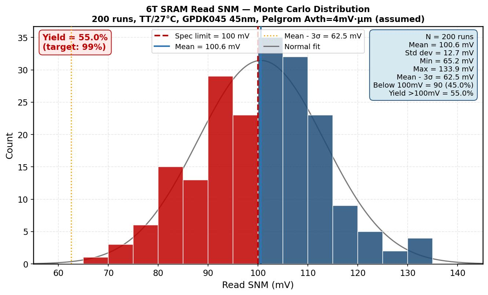
*Monte Carlo SNM distribution across the CR sweep.*

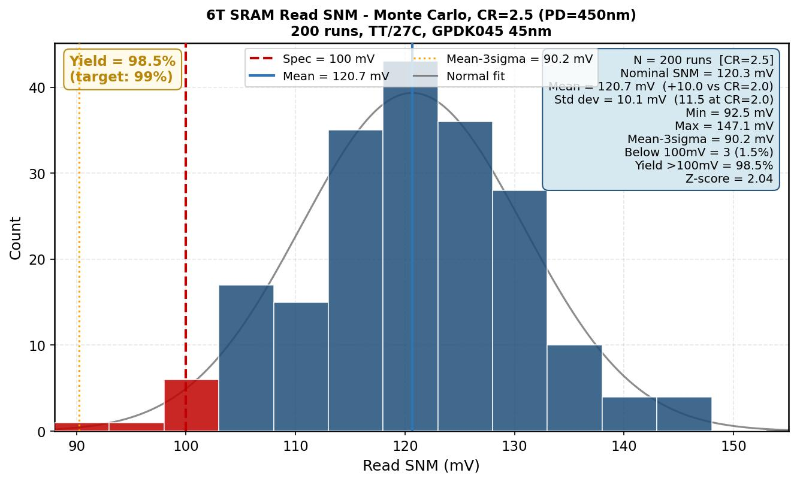
*Monte Carlo SNM distribution at the final locked sizing (CR=2.5), 200 runs — mean=120.7mV, σ=10.1mV, yield=98.5%.*

**Yield decision:** CR=2.5, mean=120.7mV, σ=10.1mV, yield=98.5% against the 99% target — the ~0.5% shortfall is within normal sampling variation for 200 runs and was accepted, given the diminishing returns and area cost of pushing CR further.

### 9.6 Debug History — Unresolved Monte Carlo Pipeline Bug (Open Item)

A later attempt to rebuild the Monte Carlo at CR=2.5 (prompted by the §9.4 nominal correction) consistently produced a mean of ~90mV, regardless of whether the pre-layout or post-layout netlist was used — despite deterministic single-point checks on both confirming true nominals of 140.0mV and 138.6mV respectively. All checkable parameters (sizing, bias, extraction method) were confirmed correct in the rebuilt script. This strongly suggests a bug in the Monte Carlo *iteration pipeline* itself (e.g. per-iteration model-patching), not the underlying circuit. **Not root-caused.** The reported yield figure (§9.5, 98.5%) uses an earlier script run believed to predate this pipeline bug. Post-layout Monte Carlo was never successfully completed as a result.

---

## 10. Transient Functional Verification (Pre-Layout)

Purpose: validate testbench mechanics only (pulse timing, initial conditions, pre-charge/bias logic) — real access-time numbers require post-layout PEX-extracted BL/BLB capacitance (§16).

**Read test:** WL pulsed 0→VDD, BL=BLB=1.2V (worst-case read bias). Cell holding stored '1' settled to Q≈1.18V/QB≈0.17V — disturbed but did not flip. PASSED.

**Write test:** WL pulsed 0→VDD, BL=0V/BLB=1.2V (write-'0'). Q flipped cleanly from ~1.2V to ~0V in sync with the WL edge. PASSED.

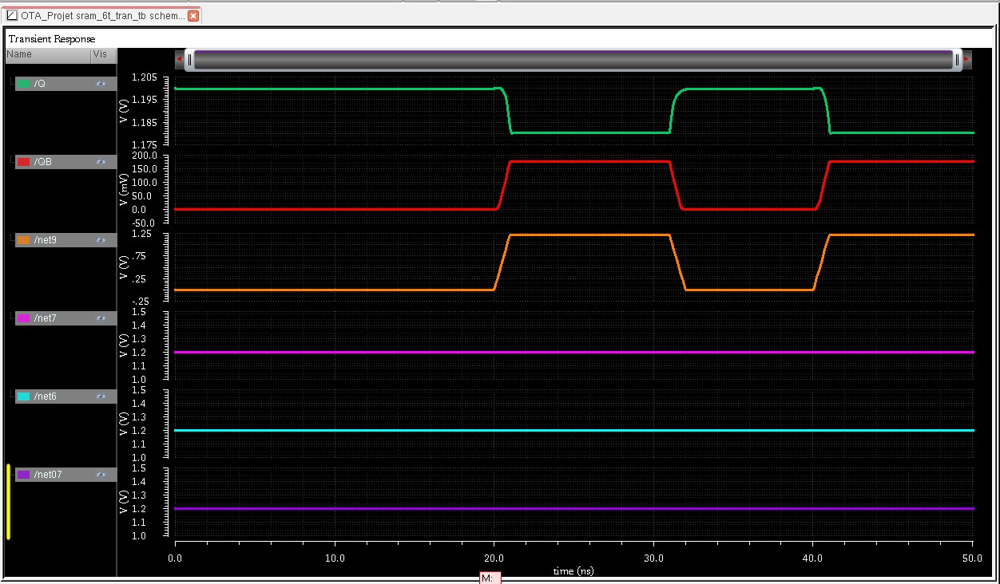
*Pre-layout transient read test — Q/QB/WL/BL/BLB waveforms.*

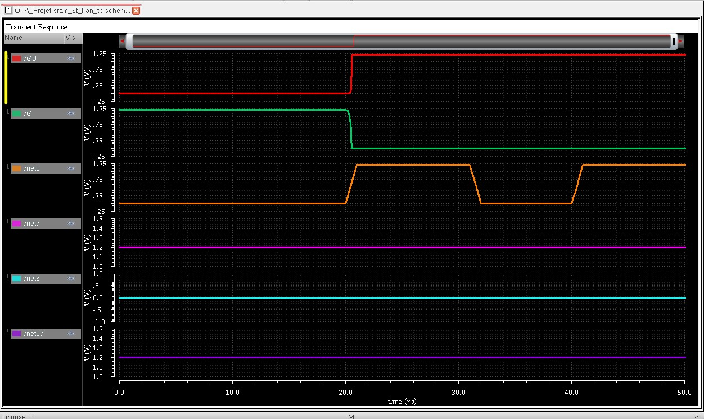
*Pre-layout transient write test — Q collapsing cleanly from 1.2V to 0V.*

---

## 11. Bit-Cell Layout

### 11.1 Floorplan and Mirroring for Shared Diffusion

PG1 flanks the left, a stacked PU1-over-PD1 inverter column, a mirrored stacked PU2-over-PD2 column, PG2 flanks the right. WL runs horizontally across the top; BL enters left, BLB right.

A transistor's diffusion order (source-gate-drain) is fixed by orientation. An identical (non-mirrored) copy of PD2 next to PD1 lands opposite-net diffusions adjacent to each other — two different nets forced together. Mirroring PD2 lands same-net diffusions (both VSS) adjacent instead, enabling a shared diffusion island. Same logic for PU1/PU2 sharing VDD-side diffusion.

### 11.2 Shared Vertical Gate

PU and PD in a CMOS inverter share the same gate net. Stacking them with poly gates vertically aligned lets one continuous poly rectangle serve as the shared gate, avoiding a metal jumper (extra contact resistance and area).

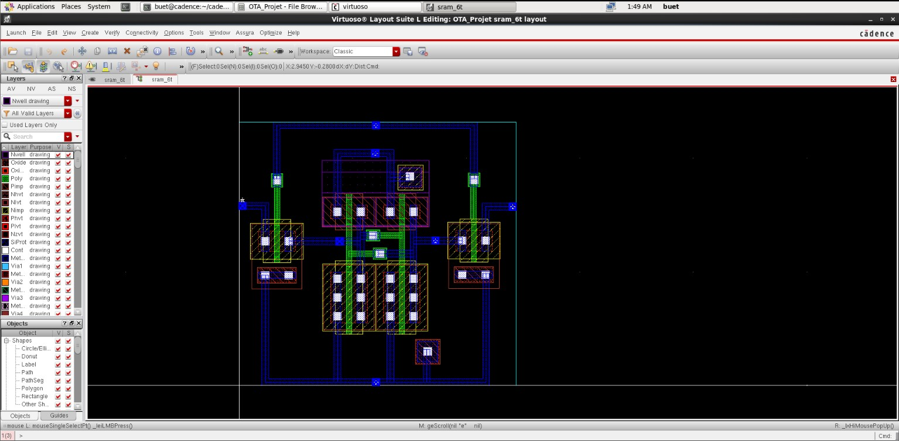
*sram_6t layout — mirrored PD/PU stacks, shared vertical poly gate, PMOS/NMOS guard rings.*

### 11.3 DRC Debug History

1. **Nwell spacing (NW.SP.2/W.1/A.1):** PU1/PU2 auto-placed in two separate Nwells; since both share VDD, the different-potential spacing rule was a false violation. **Fix:** merged into one continuous Nwell.
2. **Nwell-to-N+ Active spacing (NW.SE.1):** after merging, the well edge sat too close to the PD active area. Poly may cross a well boundary with no spacing penalty (only diffusion/well spacing is restricted). **Fix:** increased the PU-to-PD diffusion gap by stretching the shared poly gate (kept as one continuous, non-jumpered shape).
3. **Off-grid poly:** the manual poly stretch did not land on the manufacturing grid. **Fix:** snapped to the nearest legal grid point.
4. **Guard ring / floating-well errors:** expected before guard rings were placed. **Fix:** added a PMOS (Nwell) guard ring tied VDD hugging the PU region, and a separate NMOS (substrate) guard ring tied VSS framing the PD/PG region, non-touching.

### 11.4 Sign-off

DRC clean. LVS clean match. PEX RC extraction completed, view `av_extracted`.

---

## 12. Post-Layout Re-Verification

### 12.1 Methodology

A copy of the `sram_6t` layout was made with the cross-coupling loop physically broken at layout level (two new pins exposing the PD1/PU1 and PD2/PU2 gate nets separately, rather than forcing two independent sources onto a single closed-loop instance — tried first and found invalid, since with both nodes externally forced, neither is free to respond). This copy was independently DRC/LVS clean and PEX-extracted, then used in the same SNM/Write-Margin methodology (§5), now with real extracted R/C.

### 12.2 Results

| Metric | Pre-layout | Post-layout | Change |
|---|---|---|---|
| Read SNM (TT/27°C) | 140.0mV | 138.6mV | −1.4mV |
| Hold SNM (TT/27°C) | 303mV | 303.1mV | ~0 |
| Write Margin (VDD−trip) | 0.703V | 0.703V | ~0 |

The Read SNM shift comes from parasitic **resistance**, not capacitance (Read SNM is a DC sweep — capacitors are open circuits at DC). PEX adds a small series resistance between the ideal BL source and PG's real drain terminal, sitting directly in the read-disturb path (§3.2). Hold SNM is unaffected (the PG-BL path is inactive when WL=0); Write Margin is unaffected (the margin was already large).

---

## 13. Precharge / Equalization Circuit

### 13.1 Purpose and Why Equalization Is Needed

The Read SNM methodology assumes BL=BLB=VDD before a read begins; this circuit makes that true in a real array. Two independent PMOS pull-ups can each individually get close to VDD, but real bit lines can carry slightly different parasitic capacitance — two independent paths to the same rail do not guarantee *exact* equality. A third PMOS wired directly between BL and BLB forces them to the same electrical node, eliminating any residual pre-read offset.

### 13.2 Circuit

| Device | Source | Gate | Drain | Bulk | W | L |
|---|---|---|---|---|---|---|
| PC1 | VDD | PCH | BL | VDD | 180nm | 45nm |
| PC2 | VDD | PCH | BLB | VDD | 180nm | 45nm |
| EQ1 | BL | PCH | BLB | VDD | 180nm | 45nm |

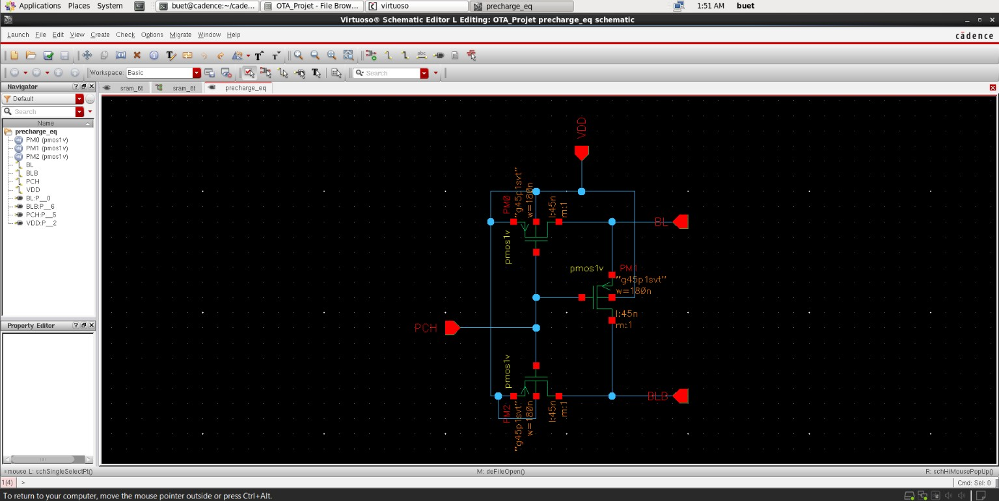
*precharge_eq schematic — PC1, PC2 (precharge pull-ups), EQ1 (equalization device).*

### 13.3 Debug History — Equalizer Gate Miswired to VDD

EQ1's gate was initially tied directly to VDD instead of PCH, permanently disabling it. Diagnosed by deliberately unbalancing BL/BLB (IC: BL=0.3V, BLB=0.9V) and observing the residual gap after the precharge pulse:

| Configuration | Residual BL/BLB gap |
|---|---|
| EQ1 disabled (miswired) | 182.3µV |
| EQ1 correctly wired to PCH | **78.6µV** |

A ~2.3× reduction, real and quantified. Both magnitudes are ~1000× smaller than the smallest SNM margin measured anywhere in this project — no stability risk either way, but the corrected wiring is the physically intended design.

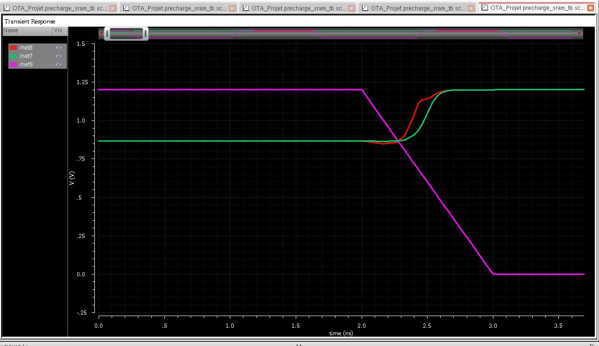
*BL/BLB convergence with EQ1 correctly wired — residual gap 78.6µV.*

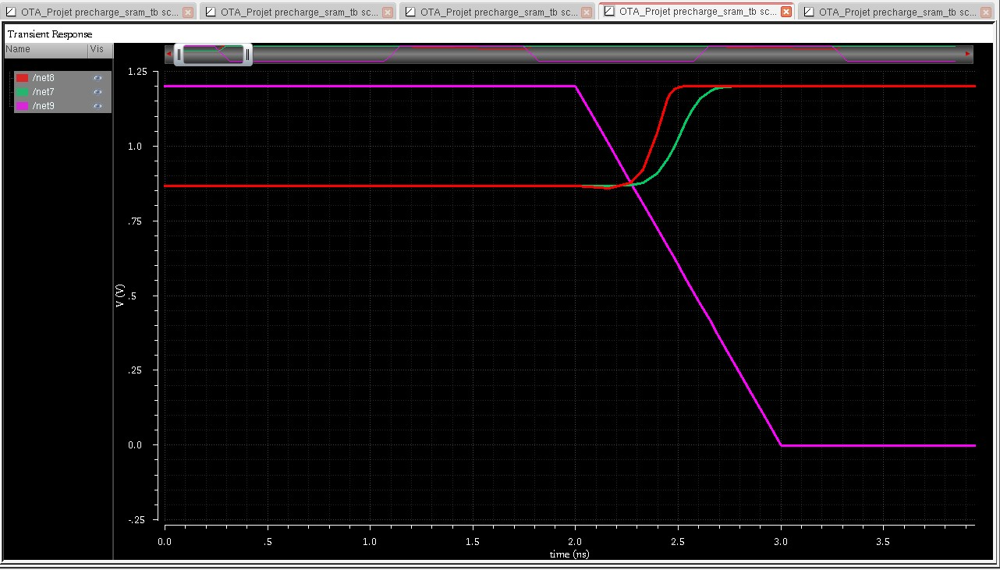
*BL/BLB convergence with EQ1 disabled — residual gap 182.3µV, roughly 2.3× worse.*

### 13.4 Functional Test Result

With BL/BLB initialised to 0.3V/0.9V and PCH pulsed low for 8ns, both lines converged to within 10mV of each other within 30ps of PCH asserting, settling at VDD by end of test.

---

## 14. Sense Amplifier

### 14.1 Purpose

A real read only produces a small BL/BLB droop within a fast access window. A sense amplifier is itself a small, separate bistable latch (same cross-coupled mechanism as §4.2), used to *amplify* a small, deliberately-forced differential into a full digital output rather than to *store* a bit — decoupling a fast decision from the slow, heavy bit line.

### 14.2 Circuit

| Device | Type | Source | Gate | Drain | Bulk | W | L |
|---|---|---|---|---|---|---|---|
| SP1 | PMOS | VDD | OUTB | OUT | VDD | 240nm | 45nm |
| SP2 | PMOS | VDD | OUT | OUTB | VDD | 240nm | 45nm |
| SN1 | NMOS | SA_TAIL | OUTB | OUT | VSS | 180nm | 45nm |
| SN2 | NMOS | SA_TAIL | OUT | OUTB | VSS | 180nm | 45nm |
| SAE | NMOS | VSS | SA_EN | SA_TAIL | VSS | 240nm | 45nm |
| NI1 | NMOS | OUT | ISO | BL | VSS | 240nm | 45nm |
| NI2 | NMOS | OUTB | ISO | BLB | VSS | 240nm | 45nm |

External pins: VDD, VSS, BL (InOut), BLB (InOut), SA_EN, ISO. OUT, OUTB, SA_TAIL internal only.

**Sizing rationale:** SP1/SP2 at 240nm (2× the 180nm NMOS width) follows the standard balanced-inverter rule — explicitly *not* applicable to the SRAM cell's own PU (§3.3), but correctly applicable here, since this latch's only job is a fast, symmetric flip, not a deliberately asymmetric fight against an access transistor.

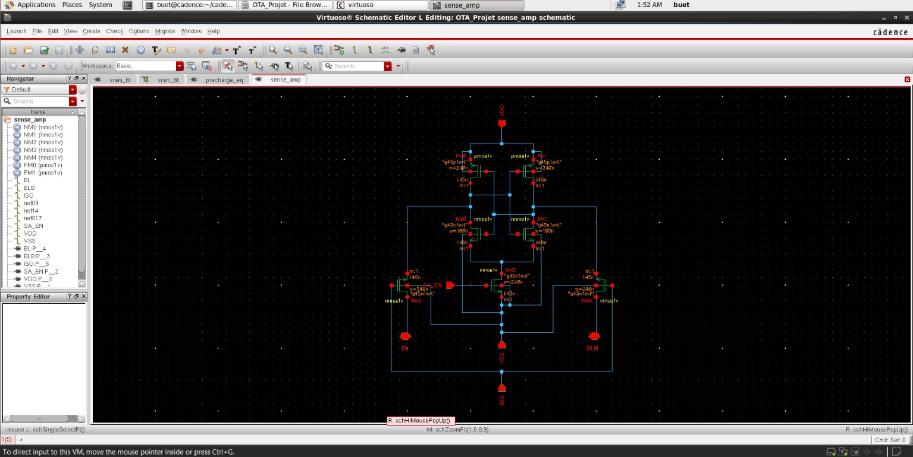
*sense_amp schematic — cross-coupled core (SP1/SP2/SN1/SN2), tail switch (SAE), isolation pair (NI1/NI2).*

### 14.3 Debug History — Premature Amplification (No Isolation)

First version tied OUT/OUTB directly to BL/BLB with no isolation devices. SAE only gates the tail (ground) path; SP1/SP2 are gated only by OUT/OUTB and were never gated by SA_EN at all. The latch began regenerating the instant WL asserted, fully resolving BL/BLB before SA_EN ever fired. Adding bit-line capacitance (5fF, then 20fF) slowed the swing but did not fix the underlying structural issue. Cross-checked against published literature, which documents the same basic-latch limitation and recommends isolation ("pass") transistors as the fix. NI1/NI2 added accordingly.

### 14.4 Debug History — ISO Timing (Single-Cell Testbench)

With ISO held permanently high, the same premature-resolution behaviour persisted (an always-on isolation transistor isolates nothing). With ISO pulsed low 300ps after WL, external BL/BLB correctly froze (confirming isolation worked structurally) but the trapped differential was already large (>0.5V), since the droop develops within ~70-100ps. **Fix:** moved ISO's falling edge to within ~20ps of WL's edge.

### 14.5 Debug History — Latch Polarity Inversion (Uninitialised Bias)

With isolation correctly timed, amplification was internally consistent but had the **wrong polarity** relative to the cell's stored value. Diagnosed by checking OUT/OUTB before WL had even asserted: already unequal (0.879V vs 1.200V) at t=0 — the latch had settled into one of its two bistable states on its own, since the resistive NI1/NI2 isolation path is too weak to override a latch that already has a strong pre-existing internal bias. **Fix:** explicit neutral initial condition (OUT=OUTB=0.6V, VDD/2) on the sense amp's own internal nodes.

### 14.6 Corrected Sample-and-Hold Mechanism

The "idle" window (ISO low, SA_EN not yet fired) is not perfectly frozen. OUT/OUTB drift upward together by ~70mV over a ~1.8ns idle window, and the differential itself nearly triples before SA_EN fires. **Correct mechanism:** SAE only disconnects the NMOS (ground-side) tail path — SP1/SP2 remain connected to VDD and weakly conduct, causing common-mode drift and slow positive-feedback regeneration even before SA_EN formally enables the fast path.

### 14.7 Validated Single-Cell Read Sequence

| Event | Time |
|---|---|
| PCH low (asserted) | 0 – 2ns |
| PCH high (released) | 2ns |
| WL asserts | ~3.03ns |
| ISO drops (isolates) | ~3.05ns |
| SA_EN asserts | ~5.03ns |
| OUT/OUTB fully resolved | ~5.2-5.3ns |

Result: OUT≈1.1998V, OUTB≈0.0001V — correct polarity, full rail-to-rail resolution, from an internal differential as small as ~0.7mV at the moment SA_EN fired.

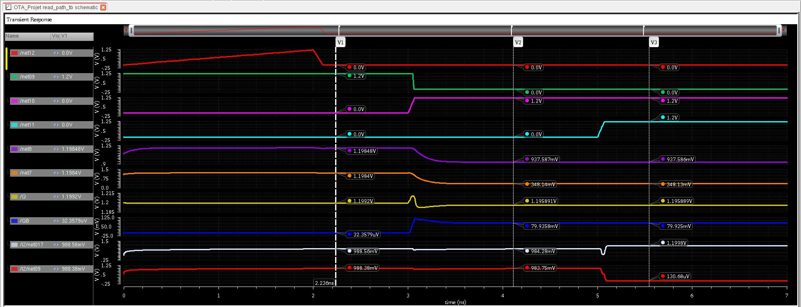
*Single-cell full read-path validated sequence — PCH, ISO, WL, SA_EN, Q, QB, and internal sense-amp nodes (I2/net017, I2/net019) resolving over ~7ns.*

---

## 15. 4×4 and 8×8 Array Construction

### 15.1 Abutment and the Checkerboard Mirror Pattern

Placing identical, non-mirrored cell copies side by side does not automatically share resources — each cell would draw its own private VDD/VSS straps. Vertically adjacent cells (same column, sharing BL/BLB by construction) are mirrored about the horizontal axis (MX) so their VDD or VSS straps align and can be shared between rows. Horizontally adjacent cells (same row, sharing WL, but *independent* BL/BLB pairs) are mirrored about the vertical axis (MY) for clean bit-line routing alignment and shared guard-ring structure.

| | Col 0 | Col 1 | Col 2 | Col 3 |
|---|---|---|---|---|
| Row 0 | R0 | MY | R0 | MY |
| Row 1 | MX | R180 | MX | R180 |
| Row 2 | R0 | MY | R0 | MY |
| Row 3 | MX | R180 | MX | R180 |

### 15.2 Routing

BL/BLB (vertical, per-column) routed on Metal2. WL (horizontal, per-row) routed on Metal3 — different layers required since the two signal sets physically cross throughout the array, with vias only at intended pin connections. VDD/VSS straps placed at each mirrored row boundary, shared between rows.

### 15.3 Array-Level Schematic and LVS

16 instances of `sram_6t` (4×4). BL/BLB tied per column, WL tied per row. VDD and VSS each tied as **one** single shared net across all 16 instances. 14 top-level pins total (BL0-3, BLB0-3, WL0-3, VDD, VSS). Q/QB are deliberately **not** exposed as top-level pins — internal, per-cell storage nodes with no real-array external access point, exactly mirroring how a real SRAM array's only external interface is through BL/BLB.

LVS produced 32 "unconnected pin" warnings (Q/QB × 16 instances) — expected and consistent between schematic and layout, not a real mismatch. Overall LVS match: clean.

### 15.4 Extending to 8×8

Since the mirror-orientation pattern has period 2 and the 4×4 block size (4) is an even multiple of that period, four signed-off 4×4 blocks were tiled directly into a 2×2 super-grid with no per-cell orientation changes needed at the block seams. Inter-block BL/BLB/WL routing at the seams still required explicit connection (abutment alone does not merge same-named nets into one electrical node). DRC clean, LVS clean, PEX extraction completed on the full 8×8 (64-cell) array.

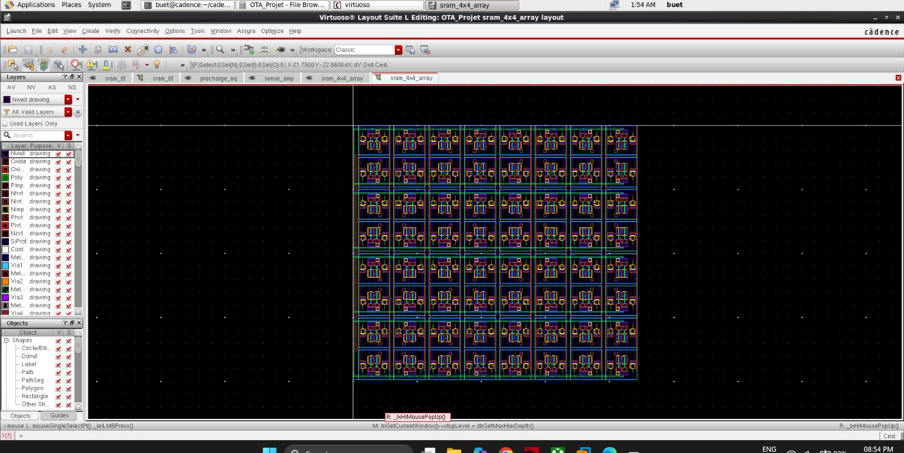
*8×8 array layout — checkerboard mirror orientation, shared VDD/VSS straps at row boundaries.*


*8×8 array layout, zoomed — mirrored cell pairs and shared diffusion/power-rail boundaries visible.*


*8×8 array-level schematic — 64 sram_6t instances, BL/BLB tied per column, WL tied per row, single shared VDD/VSS.*

---

## 16. Array Capacitance Extraction and Access Time

### 16.1 Capacitance Extraction Methodology

A single top-level lumped capacitor per BL/BLB net significantly undercounts the true value — PEX distributes real capacitance across many resistor-connected sub-node segments along the wire. Correct extraction requires a full graph traversal from the BL/BLB net through *all* resistor-connected segments (watching for multiple resistor name prefixes, e.g. `ri`/`rj`/`rg`/`rh` — an initial pass that only checked `ri`/`rj` missed the `rh`-prefixed segments carrying most of the real capacitance, understating the true value by roughly 15-20×).

### 16.2 4×4 and 8×8 Real Capacitance and Access Time

| Array | BL0 capacitance | BLB0 capacitance | Real simulated access time |
|---|---|---|---|
| 4×4 (4-row column) | 1.434fF | 1.173fF | ~10.9ps |
| 8×8 (8-row column) | 3.22fF | 2.40fF | ~11.2ps |

Only a ~3% access-time increase despite capacitance roughly doubling — at this small array scale, access time is still dominated by PG's drive strength, not RC delay; the transition to an RC-dominated regime happens at larger scale.

### 16.3 Extrapolation to Production Scale

Marginal capacitance per additional cell: BL0 ~0.45fF/cell, BLB0 ~0.31fF/cell. Linear models fit to the two real data points: `C(n) = -0.35 + 0.447×n fF`; `t(C) = 10.66 + 0.168×C ps`.

| Rows | Est. Capacitance | Est. Access Time (linear model) |
|---|---|---|
| 4 (measured) | 1.43fF | 10.9ps (measured) |
| 8 (measured) | 3.22fF | 11.2ps (measured) |
| 64 | 28.22fF | 15.4ps |
| 128 | 56.80fF | 20.2ps |

**Validation against a real simulated data point:** a real capacitor matching the 64-row prediction (28.22fF) was added directly to BL/BLB and simulated. Result: access time ~19-58ps (depending on detection threshold), noticeably *higher* than the linear model's 15.4ps prediction — the model was built from two points deep in a transistor-dominated regime and underestimates once capacitance grows into a regime where RC delay becomes a real contributor. Both the naive estimate and the validated, higher real-simulation result are reported.


*8×8 array real access-time transient — WL assertion to BL/BLB differential development.*

---

## 17. Full Read-Path Integration Test

### 17.1 Purpose

The strongest available end-to-end validation: precharge/equalization, a real PEX-extracted 8×8 array, and the sense amplifier, all wired together and tested as one system, in both schematic and fully-extracted-layout form.

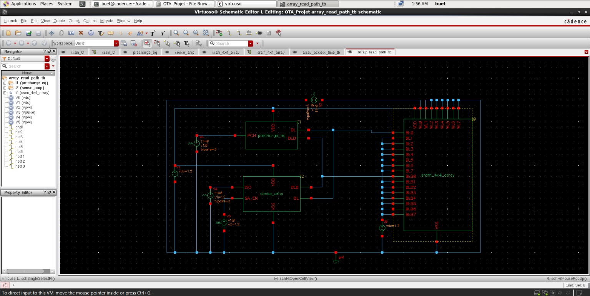
*array_read_path_tb — precharge_eq, the 8×8 array, and sense_amp wired together as one system.*

### 17.2 Debug History — No Amplification (Slow Common-Mode Drift)

First array-scale attempt showed OUT/OUTB drifting slowly downward *together* after SA_EN fired, with a nearly-constant, barely-growing differential — not the fast, decisive snap seen in the single-cell test (§14.7). **Root cause:** ISO was dropping at essentially the same instant as WL asserted (near-zero gap), leaving almost no time for a real differential to develop and reach OUT/OUTB before isolation. **Fix:** widened the WL-to-ISO gap.

### 17.3 Debug History — Q/QB Never Held (Non-Physical Behaviour From t=0)

After the ISO fix, Q started collapsing from ~1.18V within tens of femtoseconds — well before any pulse moved — and QB went **negative** (non-physical for a circuit with no inductors). Several hypotheses were checked (nodeset strength, hierarchical IC path correctness, settling time) before the actual root cause was found by directly inspecting the extracted netlist: the array-side VDD source (V1) was declared with `vsource type=dc` but **no `dc=1.2` value specified**, while the correctly-working source elsewhere in the same netlist explicitly had `dc=1.2`. The array, precharge circuit, and sense amp had been running with an undefined/zero VDD. **Fix:** added the missing `dc=1.2` parameter.

> This is the single most significant debugging lesson from the array-integration work: the fix came from directly reading the raw netlist text rather than continuing to iterate on waveform-level hypotheses.

### 17.4 Debug History — Schematic vs Layout Runs Resolving to Opposite Polarity


*Full read-path integration transient — schematic-level array run (pre-fix, tight ISO-WL gap).*


*Full read-path integration transient — post-PEX layout array run (pre-fix, tight ISO-WL gap), resolving to the opposite polarity from the schematic run.*

After fixing 17.2 and 17.3, both schematic and layout runs produced clean, fast amplification — but resolved to **opposite final polarities** for the same stored cell value. Investigation compared the trapped differential at the exact instant ISO dropped in both runs:

| Run | Trapped differential (OUTB−OUT) at ISO drop |
|---|---|
| Schematic | −0.00075V |
| Layout (post-PEX) | +0.00356V |

Opposite signs, both at the sub-mV-to-few-mV scale. **Root cause:** at the tight WL-to-ISO gap in use (13-16ps), the trapped differential was so small that it was comparable to or smaller than the real, physical layout-level asymmetry between the two nominally-identical inverter halves (real parasitic differences from how the layout was physically drawn, present even with zero deliberate Monte Carlo mismatch) — the sense amp was effectively amplifying layout-level noise rather than the true cell signal. **Fix:** widened the WL-to-ISO gap from ~13-16ps to ~80ps. Re-verified: trapped differential grew to ~4.3mV (6× larger), and both schematic and layout runs then resolved to the same, correct polarity.

### 17.5 Design Principle — The ISO Timing Window Has Two Boundaries

**Too short a gap:** the trapped differential is dominated by layout-level noise rather than the true cell signal, giving an unreliable, possibly-wrong-polarity read. **Too long a gap:** SP1/SP2 (never fully off even before SA_EN, §14.6) have more time to weakly self-reinforce OUT/OUTB toward one of the latch's own stable states on their own — the same uninitialised-latch-bias failure mode as §14.5, but triggered by timing rather than a missing IC. The validated working point (~80ps gap) sits inside this window.

### 17.6 Final Validated Result

Both schematic and layout (post-PEX) runs, with the corrected VDD source and ~80ps WL-to-ISO timing: Q holds cleanly at 1.2V from t=0, develops a small, correctly-bounded read-disturb droop (QB rising to ~0.08-0.09V) once WL asserts, and the sense amplifier resolves to OUT≈1.1998V/OUTB≈0.0001V (correct polarity) within ~200-250ps of SA_EN firing — the complete, fully validated confirmation of the entire read path, in both schematic and physical-layout form.

---

## 18. Results Summary

| Metric | Value |
|---|---|
| Final sizing | PD=450n, PG=180n, PU=120n (CR=2.5, PR=0.67) |
| Read SNM — pre-layout / post-layout | 140.0mV / 138.6mV |
| Hold SNM — pre-layout / post-layout | 303mV / 303.1mV |
| Write Margin — pre-layout / post-layout | 0.703V / 0.703V |
| Read SNM worst corner/temp | SF @ 125°C = 53.6mV |
| Hold SNM worst corner/temp | FF @ 125°C = 220.0mV |
| Write Margin best (easiest write) corner/temp | FF @ 125°C = 0.513V |
| Monte Carlo Read SNM (200 runs, reported figure) | Mean=120.7mV, σ=10.1mV, Yield=98.5% |
| 4×4 array BL0 capacitance / access time | 1.434fF / ~10.9ps |
| 8×8 array BL0 capacitance / access time | 3.22fF / ~11.2ps |
| 64-row estimated capacitance / real simulated access time | 28.22fF / ~19-58ps |
| Precharge/equalization residual mismatch (fixed / disabled EQ1) | 78.6µV / 182.3µV |
| Full read-path integration (schematic and layout) | PASSED — correct polarity, ~200-250ps resolution |
| DRC (bit-cell, array) | 0 violations |
| LVS (bit-cell, array) | Matched |

---

## 19. Key Engineering Learnings

### A Single Nominal Number Can Hide a Real Yield Problem

At CR=1.67, a single, deterministic SNM measurement (100.6mV) looked comfortably above the 100mV spec line. Only the full Monte Carlo distribution revealed the mean sat essentially *on* the threshold (Z=0.05), meaning true yield was only ~55%. A statistical distribution, not a typical-case number, is what actually determines real-array reliability.

### Reducing Sigma Cannot Fix a Mean-Limited Yield Problem

When the mean sits close to a spec threshold, narrowing the distribution around that same point barely moves yield. The only real fix is raising the mean — demonstrated directly by the CR sweep (55% → 81.5% → 98.5% yield, CR=1.67 → 2.0 → 2.5).

### Layout-Induced (Systematic) Mismatch Is a Different, Often Bigger Threat Than Random Mismatch

Random (Monte Carlo) mismatch shows up as extra spread around a fixed mean. A systematic layout bias (e.g. asymmetric parasitic loading between two nominally-identical inverter halves) instead shifts the *entire* mean for every manufactured chip — and would not show up in a Monte Carlo study at all, since Monte Carlo only models random device-to-device variation. This is the concrete reason layout matching is a hard rule, not a cosmetic preference: it protects the very assumption the whole yield study was built on. Directly observed in §17.4, where sub-mV layout-level asymmetry was large enough to flip a read's resolved polarity.

### Post-Layout Debugging Sometimes Requires Reading the Raw Netlist, Not Just Waveforms

The array-integration VDD bug (§17.3) produced confusing, non-physical waveform symptoms (QB going negative before any pulse moved) that several waveform-level hypotheses failed to explain. The actual root cause — a missing `dc=1.2` parameter — was only found by directly reading the extracted `.scs` netlist text.

### A Sense Amplifier's Isolation Timing Has Two Failure Modes, Not One

Too short a WL-to-ISO gap traps a signal dominated by layout-level noise (unreliable, possibly wrong-polarity resolution). Too long a gap lets the latch's own weak internal feedback (never fully "off") self-latch before isolation completes. The correct operating point is a genuine window between these two failure modes, found empirically in this project.

### C-Only / Full-Trace Capacitance Extraction Requires Tracing the Whole Resistor Chain

A single top-level lumped capacitor per net can understate true parasitic capacitance by 15-20× if the resistor-connected chain of intermediate wire segments (using potentially several different resistor-name prefixes) is not fully traced and summed.

---

## 20. Known Limitations and Future Work

1. **Read SNM at SS/125°C (124.5mV) falls short of the project's stated >200mV target** by ~75mV. Reaching 200mV is estimated to require CR~4.0 (PD~720nm) — judged excessive relative to area cost and not pursued further.
2. **The Monte Carlo iteration pipeline has an unresolved bug** producing a consistent ~90mV result (both pre- and post-layout) despite confirmed-correct deterministic nominal values of 140.0mV/138.6mV. Not root-caused; the reported yield figure (98.5%) uses an earlier, independently-verified script run believed to predate this bug.
3. **Post-layout Monte Carlo was never successfully completed** as a consequence of item 2.
4. **The sense amplifier and full read-path integration were validated at a single nominal timing/corner point (TT/27°C) only** — not verified across corners, temperature, or under mismatch.
5. **Column mux, row/word-line decoder, write driver, power grid, and well-strap planning** remain explicitly out of scope, as a deliberate project-scoping decision.

---

## 21. Environment and 32-bit Workarounds

| Issue | Fix |
|---|---|
| Full GPDK045 models require 64-bit Spectre (Verilog-A components) | Use the `0.1_models` PTM (BSIM4) subdirectory instead for 32-bit compatibility |
| SF/FS corners not shipped natively in the 32-bit PTM workaround | Hand-built by splicing NMOS/PMOS model blocks from existing SS/FF sections; PMOS Vth0/u0 deltas patched from the real 64-bit GPDK045 model onto the PTM base — an initial patch under-scaled PMOS variation, causing SF/FS to read numerically identical to FF/SS; corrected by re-deriving deltas against the correct PTM base Vth0 |
| DC solver fails to lock a bistable cell into the intended stored state | Two-node nodeset (both Q and QB, not just one) for DC sweeps; transient `ic` (not nodeset) for transient tests, since transient can succeed where a DC nodeset fails to converge (documented for FF/125°C write margin at the CR=1.67 sizing) |
| Point-inversion vs axis-transpose for the second SNM butterfly branch | Always use axis-transpose (swap X/Y); point-inversion is only valid for a perfectly symmetric inverter and introduces real distortion for this cell's deliberately asymmetric sizing |
| Single top-level lumped capacitor undercounts real PEX capacitance | Trace the full resistor-connected chain from the net of interest (watch for multiple resistor-name prefixes, e.g. `ri`/`rj`/`rg`/`rh`) and sum every connected segment |
| Sense amp premature amplification with no isolation | Add isolation transistors (NI1/NI2) between BL/BLB and the latch's internal OUT/OUTB nodes |
| Sense amp latch settling to an arbitrary polarity | Explicit neutral initial condition (OUT=OUTB=VDD/2) on the latch's own internal nodes before any real signal arrives |
| Non-physical, unexplained transient behaviour at t=0 (before any pulse moves) | Check the extracted netlist directly for missing/incomplete source parameters (e.g. a `vsource` with no `dc=` value) before continuing to debug at the waveform level |

---

## Supporting Documents

| File | Contents |
|---|---|
| [`SRAM_Study_Guide_Part1_Final.docx`](SRAM_Study_Guide_Part1_Final.docx) | Sizing derivation, SNM/Write Margin methodology, corner sweeps, Monte Carlo yield study, full debug history including the 120.3-vs-140.0mV correction |
| [`SRAM_Study_Guide_Part2_Final.docx`](SRAM_Study_Guide_Part2_Final.docx) | Layout, post-layout re-verification, precharge/equalization, sense amplifier, array construction, full read-path integration |
| [`SRAM_Concept_Companion.docx`](SRAM_Concept_Companion.docx) | Physical reasoning and intuition behind every concept in the project — read/write disturb mechanisms, bistability, SNM statistics, layout matching, sense-amp timing, and more |
| [`../Project_03_LDO_Voltage_Regulator/`](../Project_03_LDO_Voltage_Regulator/) | 1.2V LDO voltage regulator — feedback loop stability, compensation network design, layout, PEX debug history |
