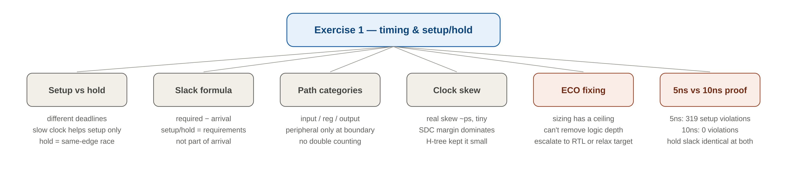
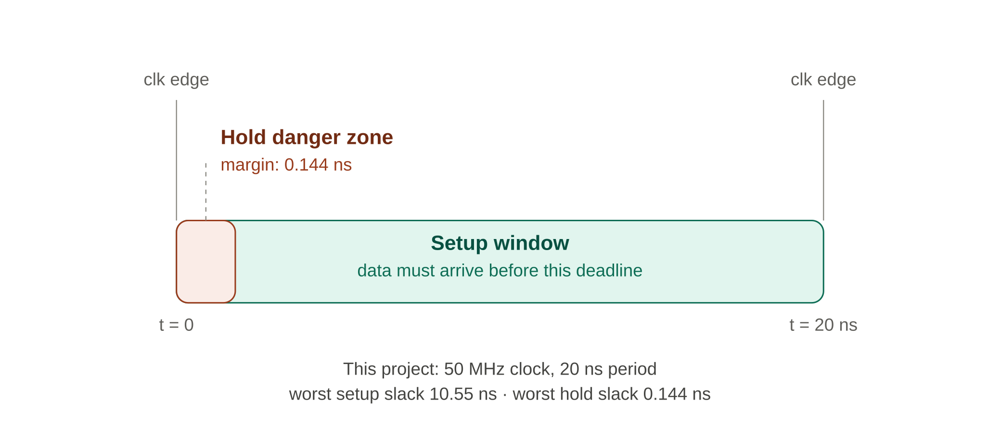
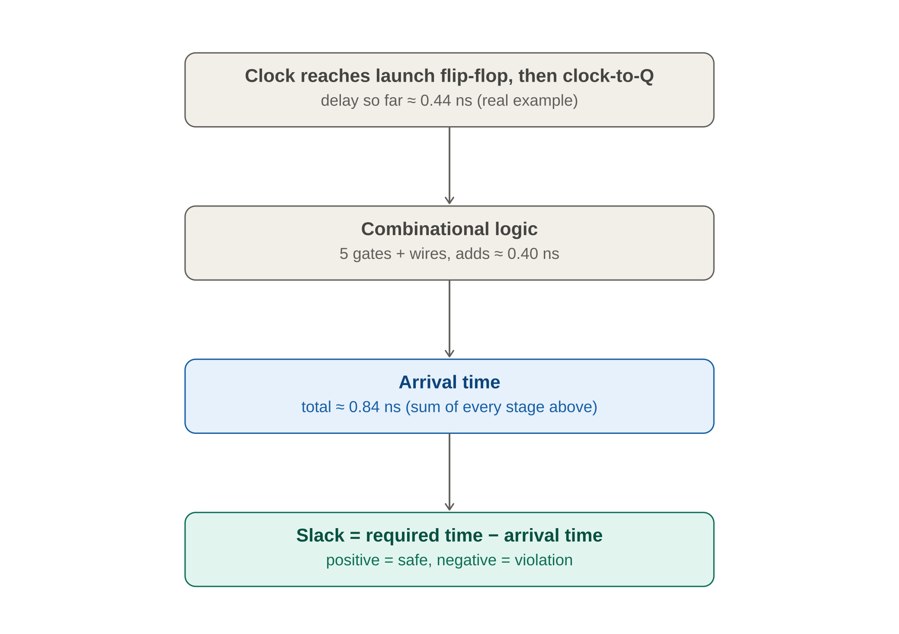
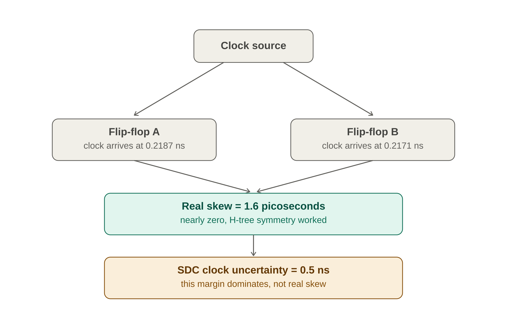
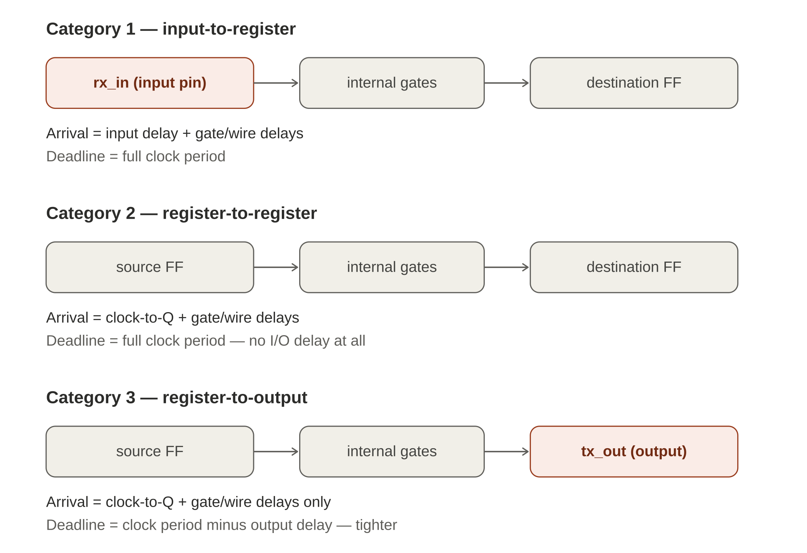
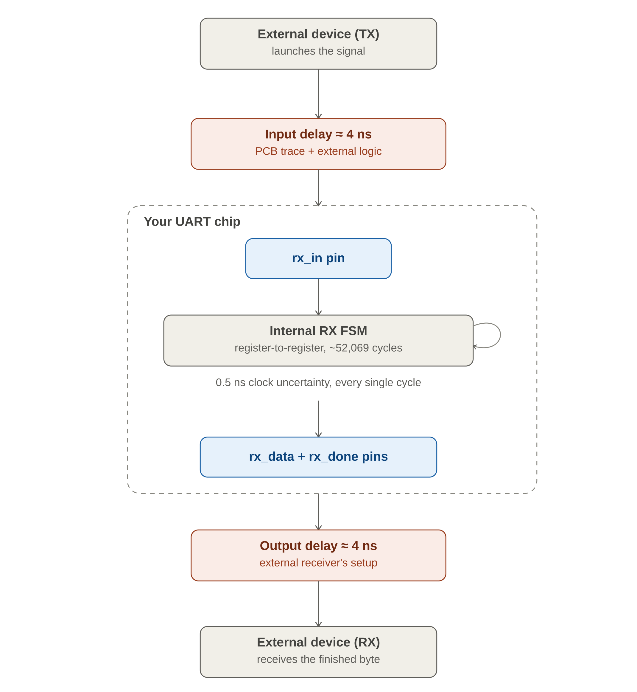

# Exercise 1 — Break, Diagnose, and Fix Timing

Deliberately push the UART's clock period far below what the design can achieve, watch real violations appear, trace the worst path, attempt a real ECO fix the way a PD engineer would, find the structural limit of that technique, then pick a realistic target and verify clean closure.

## Quick reference

## 1. Setup vs hold — the core idea

Every flip-flop obeys two timing rules. **Setup**: data must arrive before the next clock edge — don't be late. **Hold**: data must not arrive too early right around the *same* clock edge that just launched it — don't race ahead and corrupt what's being captured right now.

These two rules have completely different deadlines. Setup's deadline is the next clock edge, possibly 20ns away. Hold's deadline is glued to the current edge — a window of picoseconds.

> This is why slowing the clock fixes setup problems but does nothing for hold. Setup's deadline moves further away when the clock slows. Hold's deadline never moves — it's stuck to the edge itself.

Real proof from the project: cutting the clock period exactly in half (20ns → 10ns) left worst hold slack completely unchanged at 0.1440ns. Setup slack dropped by exactly 10ns (10.5515 → 0.5515) — exactly matching the period cut.

## 2. The slack formula

**Slack = Required Time − Arrival Time.** Positive slack means the deadline was met with room to spare; negative means a real violation.

Arrival Time builds up in stages: clock network delay to the launching flip-flop, plus that flip-flop's clock-to-Q delay, plus every gate and wire delay along the combinational path.

> Setup time and hold time are **NOT** part of Arrival Time — they are requirements belonging to the *receiving* flip-flop, living on the Required Time side of the formula instead.

## 3. Clock skew vs the margin designed in

Clock skew is the difference in clock arrival time between two flip-flops, caused by differences in their clock-tree paths. It is a property of the clock network only.

The real discovery: the H-tree's symmetric structure kept REAL skew to about **1.6 picoseconds** — nearly nothing. The much larger **0.5ns** figure in formal timing reports is almost entirely the `clock_uncertainty` margin written into the SDC — a self-imposed safety margin, not the clock tree's fault.

## 4. The three path categories

Every timing path falls into exactly one of three categories based on where it starts and ends. These are independent labels, not sequential stages a signal marches through.

> **Trap to avoid:** a single path could NOT lose both input delay AND output delay (20 − 4 − 4 − 0.5 = 11.5ns) unless it goes directly from an input pin to an output pin with no register in between. Every real path in this design picks up at most ONE peripheral delay, never both.

## 5. The signal's full journey

The clock period governs ONE clock edge at a time — it is not a stopwatch for the whole journey. Receiving one UART byte takes 10 bits × 5208 cycles/bit = **52,080 clock cycles** — about 1.04 milliseconds, over 50,000 separate edges. Of those, only about 10 cycles ever directly touch `rx_in`'s value (start-bit detection, start re-confirmation, and the midpoint of each of the 8 data bits). Only ONE cycle handles the final handoff through `rx_data`/`rx_done`. Everything else — roughly 52,069 cycles — is pure register-to-register counting.

## 6. What we actually broke — the 5ns stress test

Pushing the clock period from 20ns to 5ns produced two warnings never seen before: `RSZ-0062` (unable to repair all setup violations) and `RSZ-0064` (unable to repair all hold checks within margin).

| Metric | Value |
|---|---|
| Setup-violating paths | 319, total negative slack −64.95 ns |
| Hold-violating paths | 19, total negative slack −0.66 ns |
| Worst setup corner | `max_ss_100C_1v60` (slow corner) |
| Worst hold corner | `min_ff_n40C_1v95` (fast corner) |

A cell named `hold146` — a dedicated delay gate — was found sitting in the middle of the worst setup path, whose entire job was slowing a signal to protect a hold check elsewhere. Direct proof that fixing hold and fixing setup can pull in opposite directions when paths share logic.

A second worst path started at `rx_in`, where the 4ns input delay alone consumed 80% of the entire 5ns period before any internal gate switched — the violation had nothing to do with weak cells and everything to do with an input delay assumption sized for the old, much longer period.

## 7. Trying to fix it — ECO sizing's ceiling

Running `repair_timing -setup` directly in OpenROAD's Tcl console iterated 201 times. It genuinely helped: total negative slack improved about 21% (−53.34 → −42.05ns), 13 endpoints fully closed (62 → 49), via upsizing 23 cells, removing 9 buffers, swapping pins on 9 instances, and cloning 1 high-fanout driver.

But the single worst path barely moved — −1.899ns → −1.855ns — and the tool explicitly admitted it could not repair all violations. Every sizing technique recovers a bounded, finite amount of delay; the worst path's problem was 8 logic stages deep, far more delay than any cell swap could claw back.

A hand-picked, individual cell swap was also attempted: checking the library for stronger drive-strength variants and manually swapping `and3_1` for `and3_4`. One target cell (`nor4_4`) turned out to already be the strongest variant available — nothing bigger existed. After the manual swap, the GLOBAL worst path had shifted entirely to a different, untouched path — fixing one violation simply promoted a different one to worst.

> **The honest lesson:** ECO sizing is real and useful, with a real ceiling. Beyond that ceiling, the only genuine fixes are RTL changes (pipelining) or relaxing the constraint itself. Knowing when that ceiling has been hit — rather than iterating forever — is itself a real PD skill.

## 8. The real fix — reverting to 10ns

Picking a realistic target (10ns, just above the design's true ~9.45ns requirement) closed completely cleanly — zero violations across all 9 PVT corners, no RSZ warnings at all.

| Metric | At 20ns | At 10ns |
|---|---|---|
| Worst hold slack | 0.1440 ns | 0.1440 ns — identical |
| Worst setup slack | 10.5515 ns | 0.5515 ns — exactly 10ns less |

Both numbers are proof. Hold stayed bit-for-bit identical because hold genuinely doesn't care about clock period. Setup dropped by exactly the period reduction, because the worst path's arrival time never changed — only the deadline did.

## 9. What this taught about the PD role

Most of a PD engineer's time goes into layout and physical implementation — fixing violations with sizing, buffering, and pin swapping, never touching RTL. RTL changes belong to a different team. The boundary between those two worlds is exactly the wall hit with the worst path here.

---

**Toolchain:** OpenLane 2.3.10 (Dockerized) · OpenROAD · OpenSTA · SKY130 `sky130_fd_sc_hd`
**Related:** [Exercise 2 — Congestion](../Exercise2_Congestion/) · [Exercise 3 — Manual OpenROAD Driving](../Exercise3_ManualPD/)
