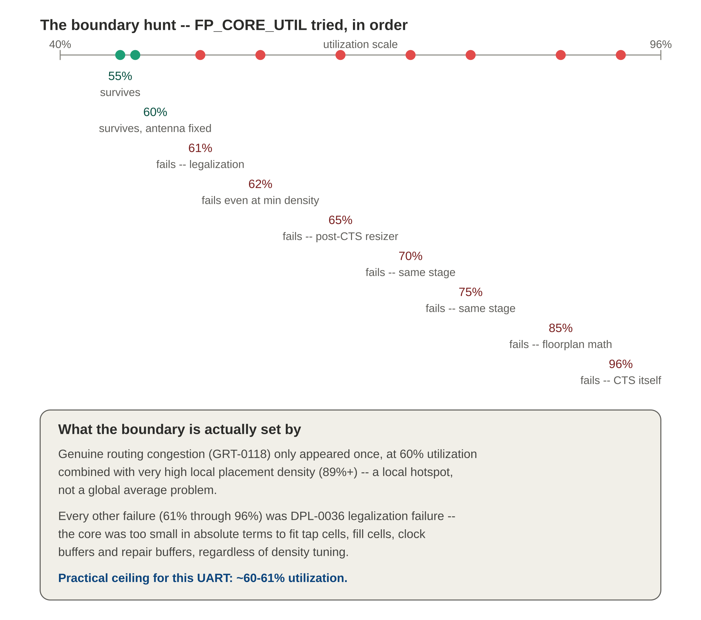
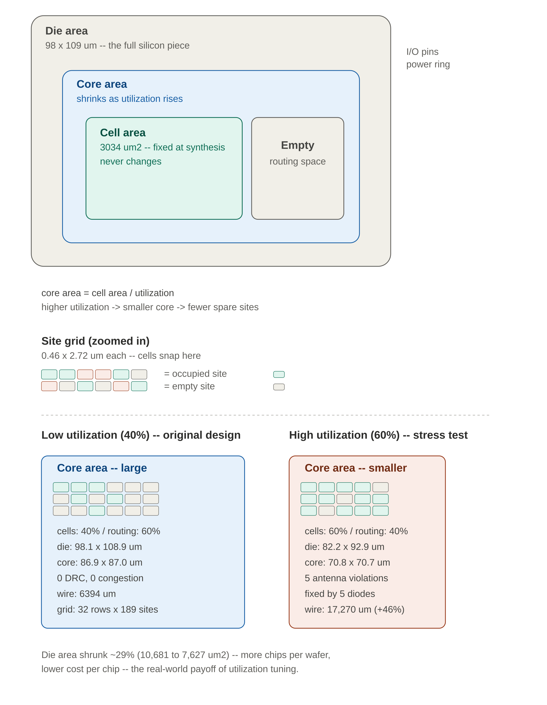

# Exercise 2 — Floorplan and Congestion Boundary

Push core utilization far beyond the original comfortable 40%, see what actually breaks first — routing congestion, as expected, or something else entirely — and trace the real boundary by hand, one trial at a time.

## 1. Two different knobs, easy to confuse

| Config key | What it actually controls |
|---|---|
| `FP_CORE_UTIL` | Sets the absolute **size** of the core, fixed at floorplan time: `core_area = cell_area / utilization` |
| `PL_TARGET_DENSITY_PCT` | Controls how tightly the **placer** clusters cells locally within that already-fixed core |

> **First mistake made and learned from:** changing `FP_CORE_UTIL` to 85 without revisiting `PL_TARGET_DENSITY_PCT` (still at 45) created an impossible contradiction — `GPL-0302`, *"Given target density 0.45, suggested target density 0.96."* The two knobs are related but independent; changing one without reconsidering the other creates a structural error that has nothing to do with the actual design.

## 2. The boundary hunt

Two distinct failure modes were found along the way. **`DPL-0036`** (detailed placement / legalization failure) appeared at every utilization from 61% up through 96%, regardless of how `PL_TARGET_DENSITY_PCT` was tuned — proving `FP_CORE_UTIL` alone sets the absolute core size, and no amount of density tuning rescues a core that is fundamentally too small to fit tap cells, fill cells, clock buffers, and repair buffers. **`GRT-0118`** (genuine routing congestion) appeared only once, at 60% utilization combined with very high local placement density (89%+) — a real local hotspot, not a global capacity problem.

## 3. Congestion numbers across the journey

| Utilization / density | Total usage | Wirelength | Result |
|---|---|---|---|
| 40% (original) | 14.2% | 6,394 µm | 0 violations anywhere |
| 55% / 60% | 19.08% | 11,847 µm | 0 overflow, legalization survives |
| 60% / 67-68% | 34.5% | 17,270 µm (+46%) | 0 overflow, 5-6 antenna violations |
| 60% / 88% | 56.06% | 25,944 µm (+2.2x) | 0 overflow, knife's edge, 3 antenna |
| 60% / 89%+ | — | — | `GRT-0118`: routing congestion too high |
| 61% / any density | — | — | `DPL-0036`: legalization fails regardless |

## 4. Antenna violations — why longer wires triggered them

During fabrication, metal layers are deposited and etched in separate steps. A long piece of exposed metal not yet connected through to the substrate can accumulate static charge from the etching process — like a literal antenna. If that metal connects to a transistor's gate (a few atoms thick), the accumulated charge can discharge destructively through that gate the moment it finally connects, rupturing the oxide.

The antenna ratio is essentially exposed metal area divided by the area of the vulnerable gate it eventually connects to. Net violations and pin violations are closely related but distinct: a pin violation is the actual detection at one specific vulnerable gate; a net violation is the rollup — at least one pin on this net violated.

> The fix happens automatically inside the flow: a diode insertion step finds each violation and inserts a tiny protection diode giving the accumulated charge a safe path to drain. Verified directly: 5 violations found, 5 diodes inserted, final re-check showed 0 net and 0 pin violations, at a cost of just 12.51 µm² of extra area.

## 5. An unexpected hold violation, at 61% / 88%

Pushing density to 88% at 61% utilization (which already fails on its own) produced something new: 60 endpoints with hold violations and 131 inserted hold buffers — a category never seen in this exercise before.

The mechanism connects directly back to Exercise 1: extremely tight local clustering at high density means very short wires between cells, and very short wires mean very low delay — exactly the condition that creates hold violations (new data races ahead too fast). Congestion stress-testing at high density inadvertently recreated a hold-violation scenario through a completely different mechanism (physical proximity) than Exercise 1's mechanism (a faster clock period), landing on the exact same underlying principle: **paths that are too fast break hold, regardless of why they got fast.**

## 6. Die area, core area, cell area, and site — the full hierarchy

Cell area is fixed at synthesis and never changes. Core area is computed from it: `core_area = cell_area / utilization`. A higher utilization target shrinks the core, which shrinks the number of available sites — directly explaining why higher utilization runs out of room for buffers.

The real-world payoff: comparing the actual floorplan results between 40% and 60% utilization, die area shrank from 98.135 × 108.855 µm down to 82.15 × 92.87 µm — about **29% smaller**. Chips are manufactured on wafers and cost is dominated by wafer count, not chip count, so a smaller die means meaningfully more chips per wafer and lower cost per chip. This is the genuine economic motivation behind utilization optimization, balanced directly against the implementation risk demonstrated throughout this exercise.

## 7. What this taught about the floorplan engineer's job

Finding the smallest die area that still lets the full implementation flow close cleanly is a real, central part of the job — trading manufacturing cost against implementation risk. The practical ceiling for this UART design sits at roughly **60–61% utilization**, set by legalization headroom rather than by routing congestion, which only became the binding constraint once density was pushed to a genuine extreme.

---

**Toolchain:** OpenLane 2.3.10 (Dockerized) · OpenROAD global/detailed placement, global routing · SKY130 `sky130_fd_sc_hd`
**Related:** [Exercise 1 — Timing](../Exercise1_Timing/) · [Exercise 3 — Manual OpenROAD Driving](../Exercise3_ManualPD/)
