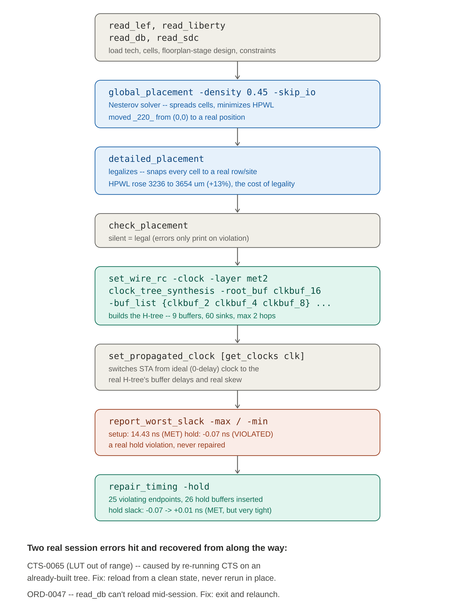

# Exercise 3 — Manual OpenROAD Driving

Instead of letting OpenLane's automation run every step invisibly, this exercise loaded a raw floorplan-stage database and drove global placement, legalization, and clock tree synthesis by hand, one OpenROAD Tcl command at a time — reading and reasoning about the result before deciding the next move, the way a PD engineer's actual interactive session works.

## The full command pipeline



## 1. Loading the design

```tcl
set PDK_DIR /home/sachin/.volare/.../sky130_fd_sc_hd
read_lef $PDK_DIR/techlef/sky130_fd_sc_hd__nom.tlef
read_lef $PDK_DIR/lef/sky130_fd_sc_hd.lef
read_liberty $PDK_DIR/lib/sky130_fd_sc_hd__tt_025C_1v80.lib
read_db .../08-openroad-floorplan/uart_top.odb
read_sdc .../rtl/uart.sdc
```

`read_lef` loads physical cell shapes and technology layers. `read_liberty` loads timing/power data for every cell. `read_db` loads the actual design — here, deliberately the floorplan-stage database, *before any cell has a position*. `read_sdc` applies the timing constraints.

> `report_design_area` is a **pure geometry calculation** (`cell_area / core_area`) — it is NOT a measure of placement progress. Proven directly: it reported 40% utilization immediately after loading the floorplan database, yet checking a specific cell's location (via the OpenDB API: `set db [ord::get_db]; set block [[$db getChip] getBlock]; $block findInst "_220_"`) returned `0 0` — sitting at the origin, completely unplaced.

## 2. Global placement

```tcl
global_placement -density 0.45 -skip_io
```

This runs TritonPlace's **Nesterov solver** — named after Nesterov's accelerated gradient method, a real numerical optimization technique — to spread cells across the core while minimizing HPWL, subject to the density target.

| Iteration | Overflow | HPWL |
|---|---|---|
| 1 | 0.982 (98% overlapping) | 747,573 (artificially low) |
| 100 | 0.965 | 611,681 (lowest point) |
| 370 | 0.099 (legal-ish) | 3,211,904 (realistic) |

> Counterintuitive but correct: HPWL got *worse* as the algorithm progressed because early iterations had cells massively overlapping (overflow near 98%), making connected cells artificially close together. Spreading cells apart to reach a physically realistic, near-legal state (overflow down to 9.9%) is exactly what pushed HPWL up to a number in the same ballpark as the eventual legalized result. Verified: `_220_` moved from `(0,0)` to `(23.176, 81.538)` µm — a real position inside the core boundary.

## 3. Detailed placement (legalization)

```tcl
detailed_placement
check_placement
```

`detailed_placement` snaps every cell onto a real, legal row/site position with zero overlap. `check_placement` verifies legality — it works by exception, printing nothing at all when the design is fully legal.

| Metric | Value |
|---|---|
| Total / average / max displacement | 479.5 / 1.8 / 6.0 µm |
| Original HPWL | 3236.1 µm (closely matched the manual ~3212µm estimate from the raw solver log) |
| Legalized HPWL | 3653.6 µm (+13%) — the cost of legality |

## 4. Two real session errors, hit and recovered from

### `CTS-0065` — LUT values out of range

Running `clock_tree_synthesis` a second time, directly on top of a database that already had a clock tree from the first attempt, produced: *"Normalized values in the LUT should be in the range [1, 1023]."* The internal characterization step almost certainly got confused trying to characterize against a clock net no longer in its original, unbuffered state.

> **Lesson:** every step in the real automated flow runs exactly once, on a database in the correct fresh state for that step. You cannot simply re-invoke a placement/CTS-style command on its own previous output and expect a clean redo.

### `ORD-0047` — db already populated

Attempting to reload a fresh database mid-session with `read_db` produced: *"You can't load a new db file as the db is already populated."*

> **Lesson:** OpenROAD holds exactly one database per session. There is no reliable command to clear it; the clean fix is to exit and relaunch the `openroad` process entirely, then redo the full correct sequence from the start in one pass.

## 5. Clock tree synthesis

```tcl
set_wire_rc -clock -layer met2
clock_tree_synthesis -root_buf sky130_fd_sc_hd__clkbuf_16 \
  -buf_list {sky130_fd_sc_hd__clkbuf_2 sky130_fd_sc_hd__clkbuf_4 sky130_fd_sc_hd__clkbuf_8} \
  -sink_clustering_enable -sink_clustering_size 25 -sink_clustering_max_diameter 50
```

`set_wire_rc` gives the tool a real electrical model of wire cost before CTS runs. `clock_tree_synthesis` builds the H-tree from a chosen root buffer and a list of progressively smaller buffer variants.

### Two hypotheses tested and honestly falsified

The manual run picked a much weaker sink buffer (`clkbuf_2`) than the automated Week 3 flow had (`clkbuf_8`), with a longer average sink wire length (154.71 vs 137.81 µm). Two explanations were tested directly rather than assumed:

- **Hypothesis 1, wire RC:** adding `set_wire_rc` before CTS and rerunning produced an **IDENTICAL** result — falsified.
- **Hypothesis 2, clustering algorithm:** the manual run's default clustering message (`CTS-0090`, capacitance-based) differed from the automated flow's (`CTS-0029`, explicit size/diameter-based). Adding the exact matching parameters (`-sink_clustering_size 25 -sink_clustering_max_diameter 50`) still produced an **IDENTICAL** result — also falsified.

The real cause was found by comparing raw sink region coordinates: the automated Week 3 run's region was `[(7165, 15020), (85755, 93780)]` while this manual run's was `[(5785, 15020), (84905, 93780)]` — genuinely different starting geometry, because a different floorplan-stage database run was loaded. Global placement's Nesterov solver has inherent run-to-run variation; two separate runs of the same flow, even with identical commands, do not always produce byte-identical cell positions, and that naturally cascades into different CTS outcomes.

> This is a real, true property of these tools worth knowing: the same flow, run twice, will not always give identical results — not a mistake, just inherent algorithmic variation.

## 6. Timing analysis and a real hold violation

```tcl
report_worst_slack -max
report_worst_slack -min
report_checks -path_delay max -digits 4
```

| Check | Result (ideal clock) | Result (propagated clock) |
|---|---|---|
| Worst setup slack | 14.14 ns (MET) | 14.43 ns (MET) |
| Worst hold slack | −0.08 ns (VIOLATED) | −0.07 ns (VIOLATED, confirmed real) |

> **Honest limitation caught along the way:** the first report used an IDEAL (zero-delay) clock model — visible directly in the trace as `clock network delay (ideal) 0.0000` — not the real H-tree just built by hand. Running `set_propagated_clock [get_clocks clk]` switched the analysis to the real buffer delays and real skew, confirming the hold violation was genuine and not just an artifact of the idealized assumption.

Why the violation existed at all: the design was placed and given a clock tree, then stopped — no timing repair pass was ever run. This is exactly the raw, unrepaired intermediate state that exists momentarily inside the real automated flow, right before its own dedicated post-CTS resizer step (seen directly in Exercises 1 and 2) runs to catch and fix exactly this kind of violation.

### The full gate-level trace, and a direct comparison to Exercise 1

The setup path `report_checks` returned, in full, was the very same path topology already traced in Exercise 1's stress test — `rx_in` through five gates to `_465_/D` — confirming this is a structurally significant path in the design, not a coincidence:

```
Startpoint: rx_in (input port clocked by clk)
Endpoint: _465_ (rising edge-triggered flip-flop clocked by clk)
    Delay      Time   Description
-------------------------------------------------------------
   4.0000    4.0000 v input external delay
   0.1703    4.1703 v _235_/X (sky130_fd_sc_hd__and2_2)
   0.3915    4.5618 ^ _355_/Y (sky130_fd_sc_hd__a211oi_2)
   0.3762    4.9379 ^ _384_/X (sky130_fd_sc_hd__and4_2)
   0.1007    5.0386 v _393_/Y (sky130_fd_sc_hd__nand4_2)
   0.2008    5.2394 v _394_/X (sky130_fd_sc_hd__and3_2)
   0.0000    5.2394 v _465_/D (sky130_fd_sc_hd__dfxtp_2)
             5.2394   data arrival time
            19.3813   data required time
-------------------------------------------------------------
            14.1418   slack (MET)
```

| | Exercise 1 (stressed, post-repair attempts) | Exercise 3 (hand-built, no repair pass) |
|---|---|---|
| Cell variants on this path | `and2_4, a211oi_4, and4_4` — strong | `and2_2, a211oi_2, and4_2` — weak, as-synthesized |
| Why they differ | Resizer had already upsized cells while fighting the 5ns stress test | No resizer pass ever ran on this hand-built design |

> The same physical path, same five gates, same design — but visibly different cell strengths depending on how much of the automated flow's resizer machinery had actually touched the design. This is direct, traceable proof of how much invisible cell-strengthening work the automated flow's multiple resizer passes (post-placement, post-CTS, post-routing) normally do behind the scenes.

## 7. Fixing the hold violation

```tcl
repair_timing -hold
```

| Metric | Before | After |
|---|---|---|
| Hold-violating endpoints | 25 | 0 |
| Hold buffers inserted | — | 26 |
| Worst hold slack | −0.07 ns | +0.01 ns |
| Worst setup slack | 14.43 ns (unaffected) | 14.43 ns (unaffected) |

> +0.01ns is an extremely tight margin — barely passing, not comfortable. Consistent with everything learned about hold throughout this whole project: the resizer's goal is to clear the violation with the minimum number of buffers, not to build in generous slack.

## 8. What this taught about driving the tool directly

Every step in the automated flow that looked like one single command was actually several: a fresh database load, the correct sequence of placement and legalization commands, a wire-RC setup step easy to forget, exact clustering parameters that mattered even when they appeared not to, and a dedicated repair pass that is not optional. Automated flows bundle dozens of small prerequisite steps invisibly; driving the tool by hand means becoming personally responsible for remembering every one of them — and when something doesn't match the automated result, the right response is to test concrete hypotheses against real evidence, not to guess and move on.

---

**Toolchain:** OpenROAD interactive Tcl shell (Docker: `ghcr.io/efabless/openlane2:2.3.10`) · SKY130 `sky130_fd_sc_hd`
**Related:** [Exercise 1 — Timing](../Exercise1_Timing/) · [Exercise 2 — Congestion](../Exercise2_Congestion/)
